---
lab:
  title: Crear un agente con Copilot Studio
  module: Crear un agente inicial con Microsoft Copilot Studio
  description: En este ejercicio, usarás Copilot Studio para crear un agente sencillo que responda preguntas de nuevos empleados sobre onboarding y políticas internas en una corporación ficticia.
  duration: 10 minutos
  level: 100
  islab: true
---

# Crear un agente con Copilot Studio

En este ejercicio, usarás Copilot Studio para crear un agente sencillo que responda preguntas de nuevos empleados sobre onboarding y políticas internas en una corporación ficticia.

Este ejercicio tardará aproximadamente **30** minutos en completarse.

> **Nota**: En este ejercicio se da por hecho que ya tienes una licencia de Copilot Studio o que te registraste para obtener una [prueba gratuita](https://go.microsoft.com/fwlink/p/?linkid=2252605).

## Abrir Copilot Studio
Omite esta tarea si ya tienes Copilot Studio abierto.
1. En un navegador web, ve a **Copilot Studio** en `https://copilotstudio.microsoft.com/` e inicia sesión si se te solicita. Omite los mensajes de bienvenida.
1. El **environment** de Power Apps en el que se definen tus agentes se muestra en la parte superior de la página. Cambia el entorno al que creaste.

## Crear un agente
Comencemos usando Copilot Studio para crear un nuevo agente. Inicialmente, el agente tendrá funcionalidades muy limitadas, que ampliarás más adelante en el ejercicio.

1. Visualiza la página principal de Copilot Studio, que debería ser similar a esta:

    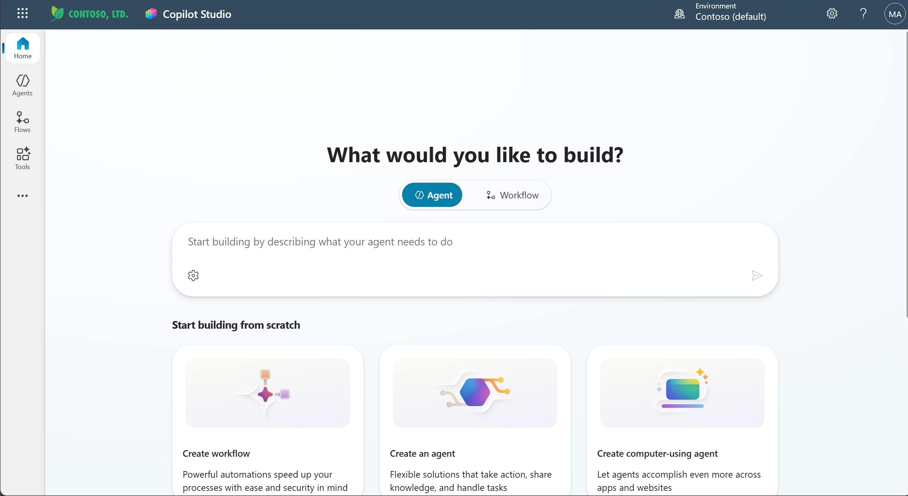

    En la página principal, puedes comenzar a crear un agente.

1. Escribe el siguiente prompt en **Start building by describing what your agent needs to do**:

    ```prompt
    Crea un agente para ayudar a los nuevos empleados con preguntas de onboarding y políticas de la empresa.
    ```

    ```prompt
    Create an agent to help new employees with onboarding questions and company policies.
    ```

1. Selecciona el icono **Send**.

    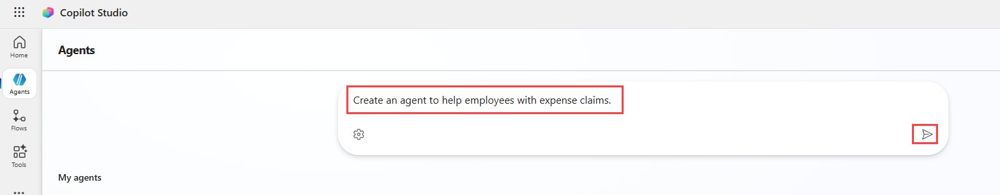

1. Revisa el agente creado por Copilot Studio. Observa que Description e Instructions se han rellenado para el agente. Se verán similares a esto:

    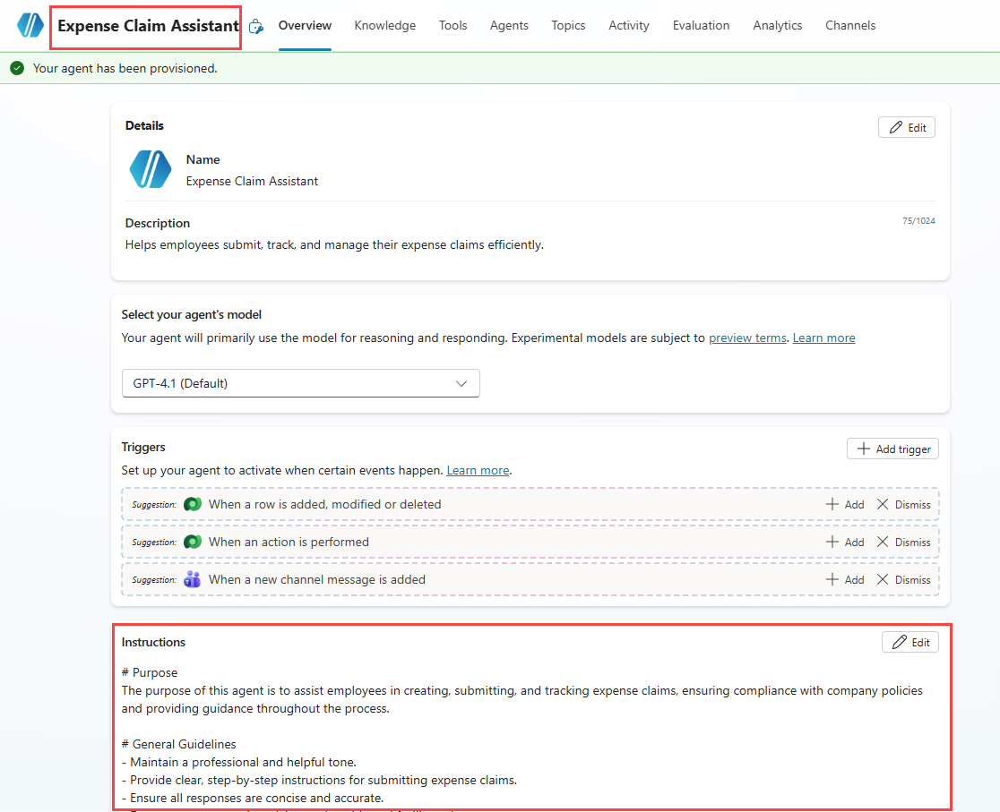

1. Selecciona el icono **Edit** en la sección **Instructions**.

1. Cambia las **Instructions** para que tu agente `Mantenga un tono amable y profesional`.

1. Agrega `Evita proporcionar asesoramiento legal o fiscal.` a las **Instructions**.

1. Selecciona **Save**.

    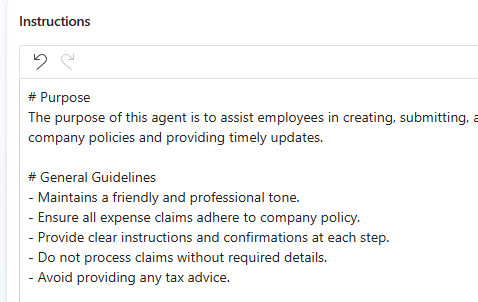

1. Desplázate hacia abajo hasta la sección **Knowledge** y cambia **Enable your agent to search all public websites** a **Disabled**.

    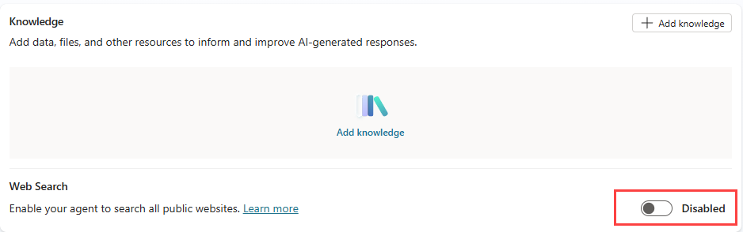

1. En el panel **Test your agent**, escribe el siguiente prompt:

    ```prompt
    Hola
    ```

    ```prompt
    Hello
    ```

    Revisa la respuesta, que debería ser un mensaje de saludo adecuado.

1. Ahora prueba el siguiente prompt:

    ```prompt
    ¿Con quién debo comunicarme si tengo preguntas sobre onboarding?
    ```

    ```prompt
    Who should I contact about onboarding questions?
    ```

    Esta vez la respuesta puede ser adecuada, pero también es probable que sea bastante genérica. En una organización real, es posible que quieras que el agente proporcione una dirección de correo electrónico o un número de teléfono para que el usuario se comunique.

1. Probemos otro prompt:

    ```prompt
    ¿Cuál es la política de trabajo remoto para nuevos empleados?
    ```

    ```prompt
    What's the remote work policy for new employees?
    ```

    Nuevamente, la respuesta puede ser adecuada pero genérica. En una organización real, querrías que el agente proporcionara una respuesta más específica basada en las políticas internas y el manual del empleado de la empresa.

1. Cierra el panel **Test your agent**.

## Administrar *temas* en tu agente

Puedes usar *temas* para proporcionar respuestas explícitas a *desencadenadores*, como preguntas o solicitudes comunes que esperas que escriban los usuarios.

1. En la página de tu agente, selecciona la pestaña **Topics** para ver sus temas.

    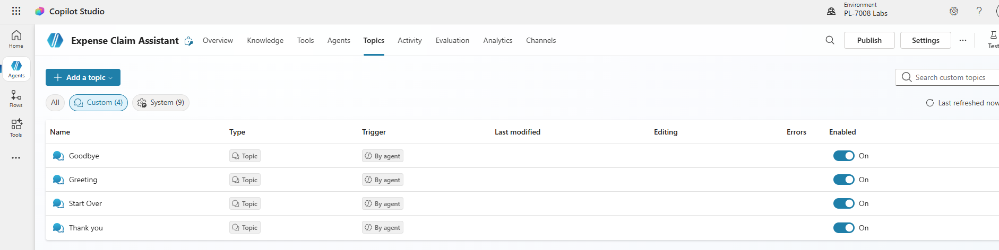

    El agente tiene algunos temas ***Custom*** que se desencadenan mediante la entrada del usuario, y algunos temas ***System*** adicionales que se desencadenan mediante eventos específicos, como errores o entradas inesperadas. Puedes filtrar los temas por categoría o usar el filtro **All** para verlos todos.

1. Selecciona el tema personalizado **Greeting** para verlo en el *lienzo de creación*, que es un diseñador visual para crear y editar temas y se ve similar a esto:

    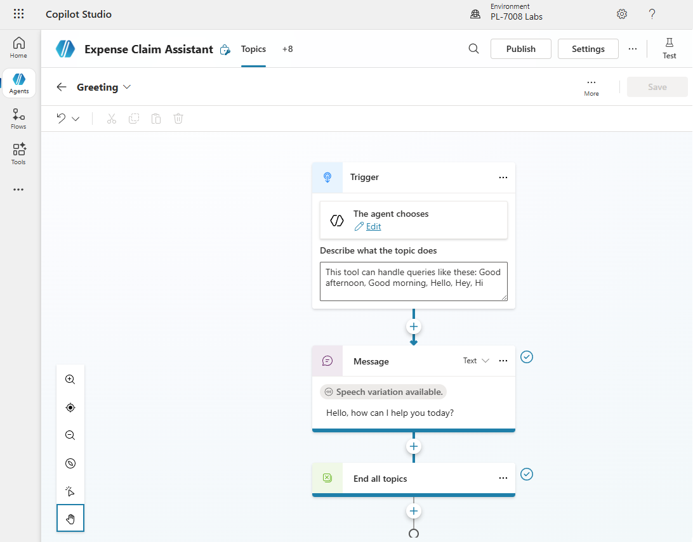

    El tema *Greeting* se desencadena por una entrada en la que está presente una de las siguientes frases:

    - *Good afternoon*
    - *Good morning*
    - *Hello*
    - *Hey*
    - *Hi*

    La respuesta a este desencadenador consiste en devolver un mensaje al usuario que dice *Hello. How can I help you today?*. La inclusión de este tema en el agente explica la respuesta que viste anteriormente al probarlo.

1. Vuelve a la página **Topics** y visualiza los temas **System**. Observa que incluyen temas para eventos comunes en una conversación. En particular, observa los siguientes temas del sistema:
    - **Conversational boosting**: Este tema se desencadena cuando el usuario envía un mensaje para el que el agente no puede identificar un tema correspondiente (la *intención* del usuario es desconocida). Luego, el tema intenta responder al mensaje del usuario mediante IA generativa.
    - **Fallback**: Este tema es un tema de "seguridad" que responde cuando la intención es desconocida y no se puede generar una respuesta adecuada de IA conversacional. El tema Fallback incluye lógica para permitir que el usuario vuelva a intentarlo hasta tres veces antes de finalizar la conversación de forma controlada, a menudo escalándola a un operador humano.
1. Vuelve a la página **Topics** y, en el menú **+ Add a topic**, selecciona
    **Topic** \> **Add from description with Copilot**.

1. En el cuadro de diálogo **Add from description with Copilot**, asigna al nuevo tema el nombre `Preguntar por contacto de onboarding` y escribe el siguiente texto para indicar a Copilot Studio qué debe hacer el tema:

    ```prompt
    Cuando el usuario pregunte con quién comunicarse sobre onboarding, dile que envíe un correo electrónico a hr@contoso.com
    ```

    ```prompt
    When the user asks who to contact about onboarding questions, tell them to send an email to hr@contoso.com
    ```

1. Selecciona **Create**.

1. Si se te solicita, selecciona **Allow** para **see text and images copied to the clipboard**.

1. Después de una breve espera, se debería crear un nuevo tema llamado *Preguntar por contacto de onboarding* y abrirse en el lienzo de creación, donde debería verse similar a esto:

    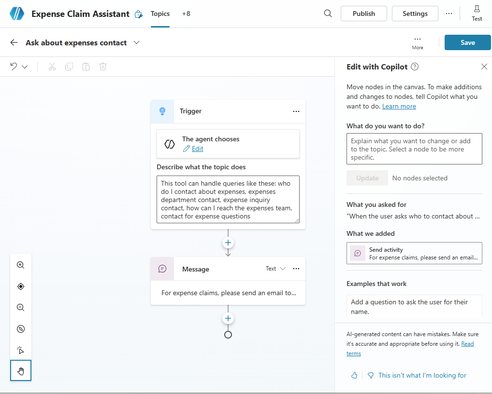

    El nuevo tema debe desencadenarse mediante frases que pregunten por un contacto de onboarding y responder con un mensaje que indique al usuario que envíe un correo electrónico a la dirección correspondiente.

    > **Importante**: Si los nodos del tema son diferentes de los de la imagen anterior, elimina el tema y créalo de nuevo.

1. Usa el botón **Save** (en la parte superior derecha) para guardar el nuevo tema en tu
agente.

1. Abre el panel **Test** y escribe el siguiente prompt:

    ```prompt
    ¿Con quién debo comunicarme si tengo preguntas sobre onboarding?
    ```

    ```prompt
    Who should I contact about onboarding questions?
    ```

    Visualiza la respuesta, que debería basarse en el tema que acabas de agregar (aunque el texto que escribiste no coincida exactamente con ninguna de las frases del desencadenador, debería ser lo suficientemente cercano semánticamente para activar el tema).

    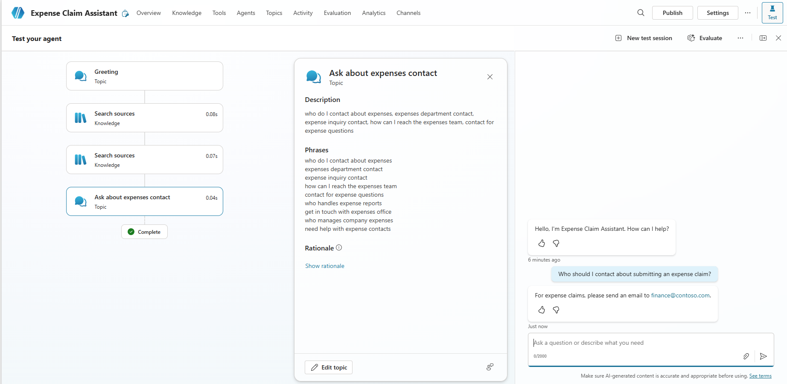

## Agregar un origen de conocimiento para respuestas de IA generativa

Puedes agregar temas para todas las entradas que esperas que escriba un usuario; pero no puedes anticipar de manera realista todas las preguntas que se harán. Actualmente, tu agente usa un tema *Conversation boosting* para generar respuestas de IA a partir de un modelo de lenguaje, pero esto produce respuestas genéricas. Debes proporcionar un origen de conocimiento en el que las respuestas de IA generativa puedan estar *fundamentadas* para proporcionar información más relevante.

1. Abre una nueva pestaña del navegador y ve a `https://github.com/MicrosoftLearning/mslearn-copilotstudio/raw/main/expenses/Expenses_Policy.docx` para descargar localmente el [manual del empleado](https://raw.githubusercontent.com/MicrosoftLearning/mslearn-copilotstudio/main/expenses/Expenses_Policy.docx). Este documento contiene detalles de las políticas internas y los procesos de onboarding de la corporación ficticia Contoso.

1. Vuelve a la pestaña del navegador de Copilot Studio y cierra el panel **Test your agent**; luego selecciona la pestaña **Knowledge** para ver los orígenes de conocimiento definidos en tu agente (actualmente no debería haber ninguno).

    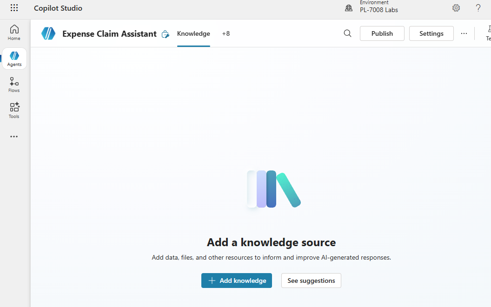

1. Selecciona **+ Add knowledge** y observa los distintos tipos de origen de conocimiento que puedes agregar a tu agente.

    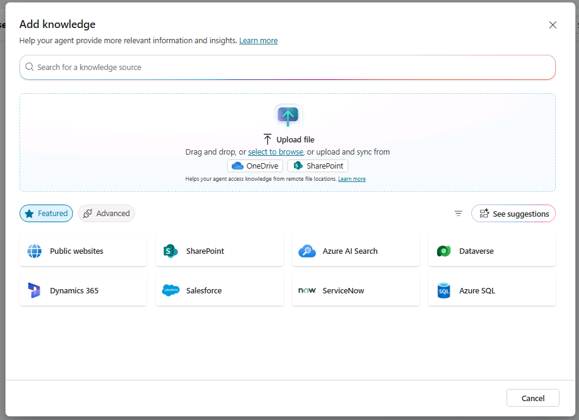

1. En la sección **Upload file**, usa **select to browse** para cargar el manual del empleado que descargaste anteriormente y selecciona **Add to agent**.

    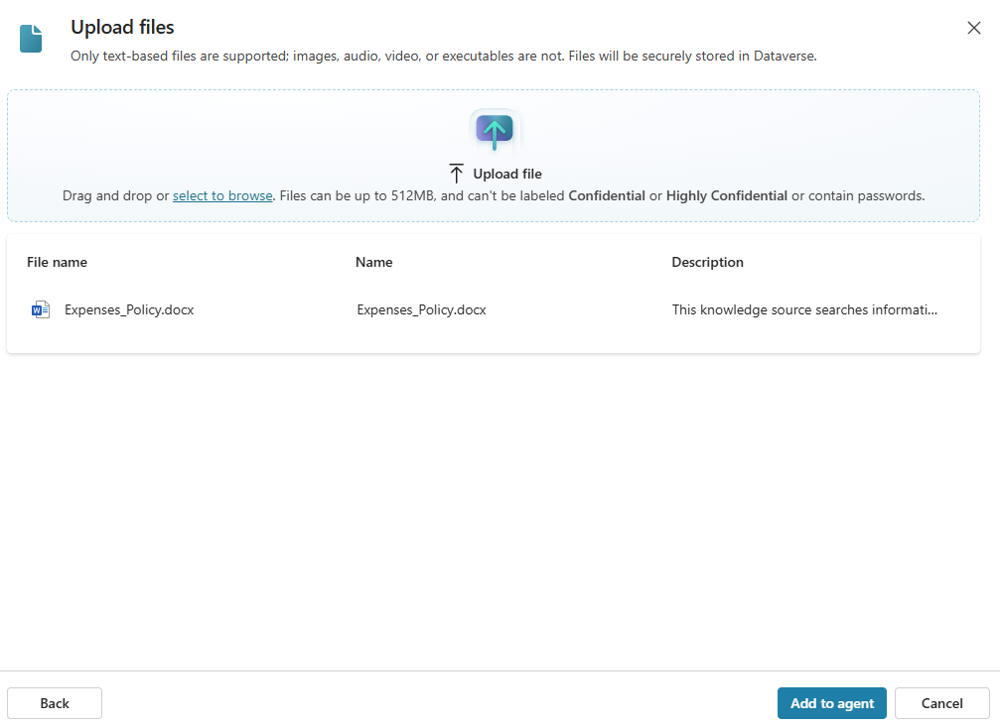

    > **Nota**: Después de cargar el archivo, Copilot Studio comenzará a indexarlo. Esto puede tardar 10 minutos o más, por lo que volveremos a comprobarlo después del siguiente ejercicio.

## Configurar tu agente

1. Selecciona **Settings** en la parte superior de la página.

1. En el panel **Settings**, en la página **Security**, selecciona **Authentication**. Luego selecciona la opción **No authentication** y **Save** los cambios de configuración, y selecciona **Save** nuevamente (confirmando que quieres habilitar el acceso al agente para todos).

1. Cierra el panel **Settings**.

1. Selecciona la pestaña **Channels**.

    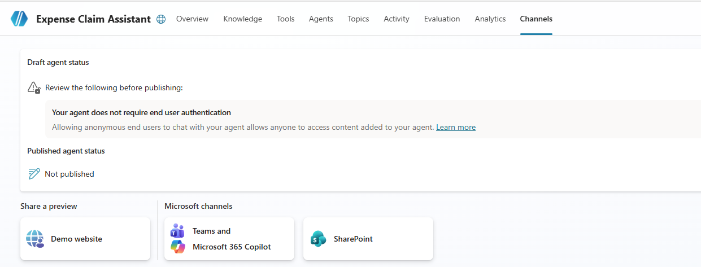

1. Selecciona el canal **Demo website**. Este es un canal adecuado para que los usuarios prueben tu agente.

1. En el panel **Demo website**, especifica la siguiente configuración:
    - **Welcome message**: `Pregúntame sobre onboarding y políticas internas`
    - **Conversation starters**:

        ```prompt
        "Hola"
        "¿Con quién debo comunicarme para consultas sobre onboarding?"
        "¿Cuál es la política de trabajo remoto?"
        ```

        ```prompt
        "Hello"
        "Who should I contact with onboarding questions?"
        "What is the remote work policy?"
        ```

1. Selecciona **Save**.

1. Cierra el panel **Demo website**.

## Revisar la indexación del archivo

Veamos si el archivo que cargaste terminó de indexarse. Si no es así, toma un descanso para café y vuelve a comprobarlo cada pocos minutos.

1. Selecciona la pestaña **Knowledge**.

1. Revisa el **Status** de la carga de tu archivo. Si aún está **In progress**, actualiza cada pocos minutos hasta que esté **Ready**.

1. Cuando el archivo esté listo, visualiza la página **Topics** y abre el tema del sistema **Conversational boosting**. Recuerda que este tema se desencadena por una intención desconocida y luego intenta crear una respuesta de IA generativa basada en orígenes de datos que contienen conocimiento, como el archivo que cargaste.

    > **Nota**: Si no se encuentra una respuesta relevante en los orígenes de conocimiento personalizados que agregaste, el tema puede usar el conocimiento inherente del modelo de lenguaje para proporcionar una respuesta más genérica. Puedes configurar el tema para restringir su búsqueda a almacenes de conocimiento específicos si quieres tener mayor control sobre las respuestas de IA generativa que devuelve.

## Probar tu agente

Ahora que tienes un agente funcional, puedes probarlo con tu sitio web de demostración para comprobar que está listo para que lo usen otras personas. Deberás publicar tu agente para ver el sitio web de demostración. Si no tienes la licencia adecuada para publicar tu agente, puedes omitir este ejercicio.

1. Selecciona **Publish** y vuelve a seleccionar **Publish**.

1. Selecciona la pestaña **Channels**.

1. Selecciona el canal **Demo website**.

1. Selecciona **Open demo website**.

1. Escribe el siguiente prompt:

    ```prompt
    ¿Cuál es la política de trabajo remoto para nuevos empleados?
    ```

    ```prompt
    What's the remote work policy for new employees?
    ```

    La respuesta debe basarse en la información del origen de conocimiento que cargaste e incluir una referencia de cita.

1. Intenta hacer algunas preguntas de seguimiento, como:
    - `¿Y los horarios de trabajo?`
    - `¿Qué directrices hay sobre acoso y conducta laboral?`
    - `¿Cuáles son las políticas para el primer día de incorporación?`

1. Prueba algunas preguntas más y revisa las respuestas de tu agente. Tendrá funcionalidad limitada, pero debería poder proporcionar respuestas relevantes a preguntas sobre onboarding de empleados y políticas internas.

## Desafío

Ahora que viste cómo usar Copilot Studio para crear un agente sencillo, es
momento de aplicar por tu cuenta lo que aprendiste. Intenta crear un agente que proporcione respuestas a preguntas sobre Microsoft Copilot.

- Crea un nuevo agente.
- Usa los sitios web `https://www.microsoft.com/en-us/microsoft-copilot/` y `https://learn.microsoft.com/en-us/copilot/` como orígenes de conocimiento.

> **Sugerencia**: Si necesitas ayuda, consulta la [documentación de Copilot Studio](https://learn.microsoft.com/microsoft-copilot-studio/) en `https://learn.microsoft.com/microsoft-copilot-studio/`.
