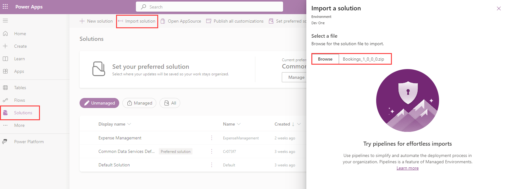
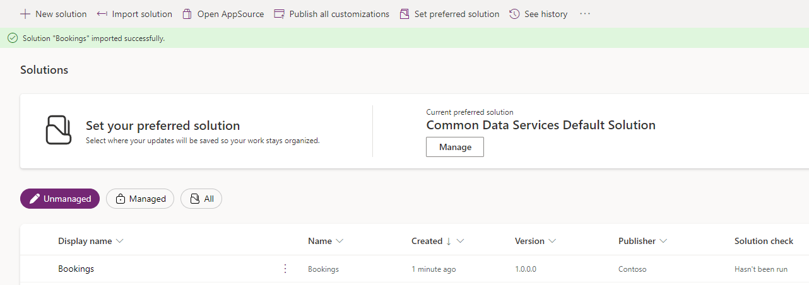
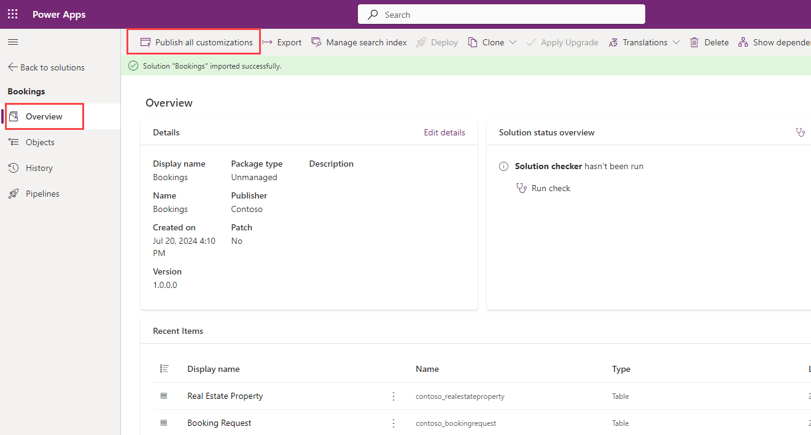
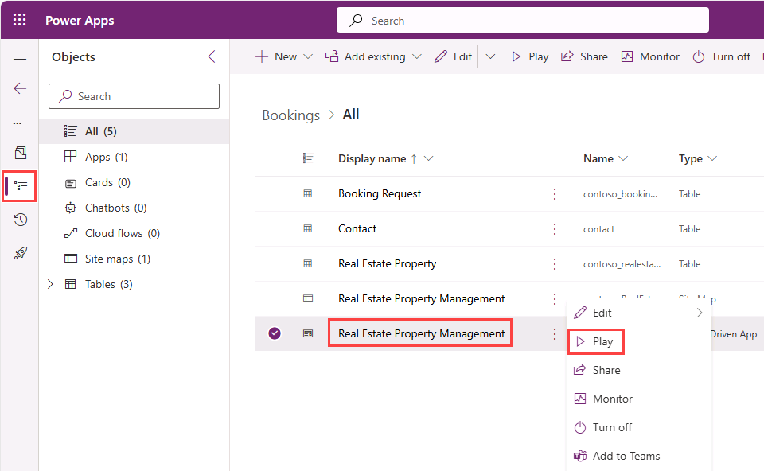
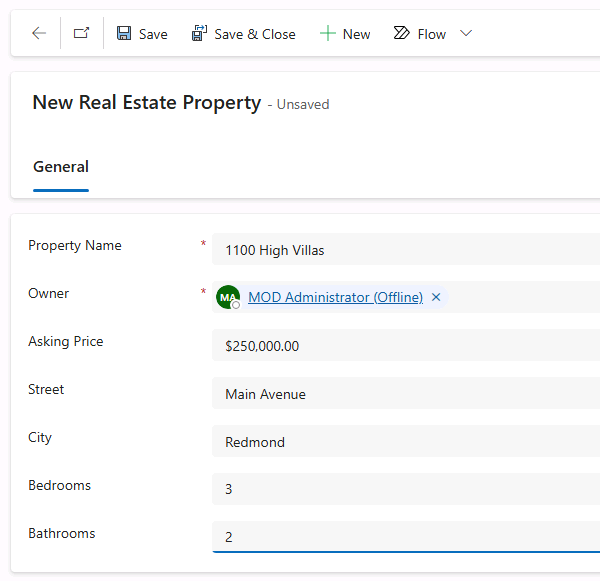
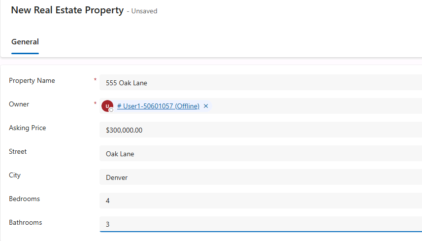

---
lab:
  title: Importar una solución de Dataverse
  module: Crear un agente inicial con Microsoft Copilot Studio
  description: En este ejercicio, importará una solución (solution) de Dataverse en su entorno (environment) que contiene las tablas (tables) necesarias para los laboratorios.
  duration: 70 minutos
  level: 100
  islab: true
---

# Importar una solución de Dataverse

En este ejercicio, importará una solución (solution) de Dataverse para usarla en los siguientes laboratorios. La solución (solution) incluye una aplicación basada en modelo (model-driven app) para crear y administrar propiedades inmobiliarias (Real Estate Properties).

Este ejercicio tardará aproximadamente **10** minutos en completarse.

## Ejercicio 1 – Importar una solución

En este ejercicio, importará una solución (solution) de Dataverse en su entorno (environment) que contiene las tablas (tables) necesarias para los laboratorios.

### Tarea 1.1 – Descargar la solución

1. En una nueva pestaña del explorador, vaya a `https://github.com/MicrosoftLearning/mslearn-copilotstudio/raw/main/Allfiles/Bookings_1_0_0_0.zip` para descargar el archivo **Bookings_1_0_0_0.zip**.

### Tarea 1.2 – Importar la solución

1. En una nueva pestaña del explorador, vaya a `https://make.powerapps.com`.

1. Si se le solicitan credenciales, inicie sesión con su dirección de correo electrónico y contraseña.

1. Si se le solicita información de contacto, establezca Country/region y seleccione **Get Started**.

1. En la esquina superior derecha de la pantalla, compruebe que **Environment** esté establecido en su entorno (environment). Aquí trabajará durante todos los laboratorios. Si no es así, seleccione el entorno (environment) adecuado.
    > **Nota:** Si, en cualquier momento durante estos laboratorios, la barra de navegación superior no se carga por completo y no puede ver el nombre de Environment, es posible que deba actualizar el explorador (Fn+F5).

1. En el panel de navegación izquierdo, seleccione **Solutions**.

1. En la barra superior, seleccione **Import solution**.

1. Seleccione **Browse**, busque el archivo **Bookings_1_0_0_0.zip** en su carpeta Downloads y seleccione **Open**.

    

1. Seleccione **Next**.

1. Seleccione **Import**.

    La solución (solution) se importará en segundo plano. Esto puede tardar unos minutos. Puede actualizar la ventana.

    

    > **Alerta:** Espere hasta que la solución (solution) haya terminado de importarse antes de continuar con el siguiente paso.

1. Cuando la solución (solution) se haya importado correctamente, abra la solución (solution) **Bookings**.

1. En el panel de navegación izquierdo, seleccione la pestaña **Overview**.

    

1. Seleccione **Publish all customizations**.

### Tarea 1.3 – Establecer la solución preferida

1. Seleccione **Back to solutions** (icono de flecha hacia atrás).

1. Seleccione **Set preferred solution**.

1. Seleccione **Bookings (contoso)**.

1. Seleccione **Apply**.

### Tarea 1.4 – Datos de prueba

1. En el panel de navegación izquierdo de la solución (solution) Bookings, seleccione la pestaña **Objects**.

1. Seleccione el menú **ellipses …** de la aplicación basada en modelo (model-driven app) **Real Estate Property Management** y seleccione **Play**. Esta es una aplicación basada en modelo (model-driven app) sencilla que le permitirá crear nuevos registros (records) de propiedades inmobiliarias (Real Estate Property).

    

1. Seleccione **+ New**.

1. Escriba los siguientes datos:

    - **Property Name:** `1100 High Villas`
    - **Owner:** Seleccione su usuario (busque el nombre de usuario que se le proporcionó)
    - **Asking Price:** `250,000`
    - **Street:** `Main Avenue`
    - **City:** `Redmond`
    - **Bedrooms:** `3`
    - **Bathrooms:** `2`

    

1. Seleccione **Save & Close**.

1. Seleccione **+ New**.

1. Escriba los siguientes datos:

    - **Property Name:** `555 Oak Lane`
    - **Owner:** Seleccione su usuario
    - **Asking Price:** `300,000`
    - **Street:** `Oak Lane`
    - **City:** `Denver`
    - **Bedrooms:** `4`
    - **Bathrooms:** `3`

    

1. Seleccione **Save & Close**.

Ahora tiene 2 propiedades inmobiliarias (Real Estate Properties) Active en la vista.
