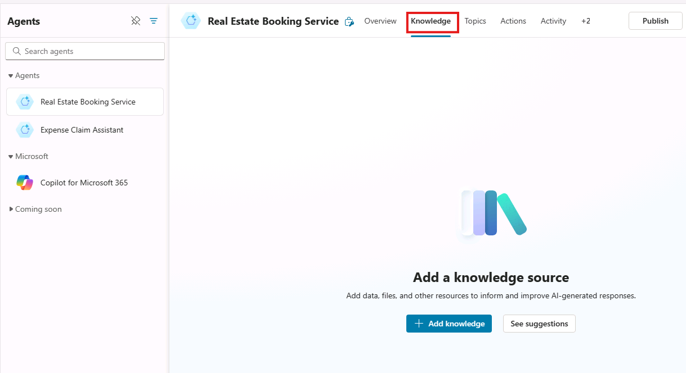
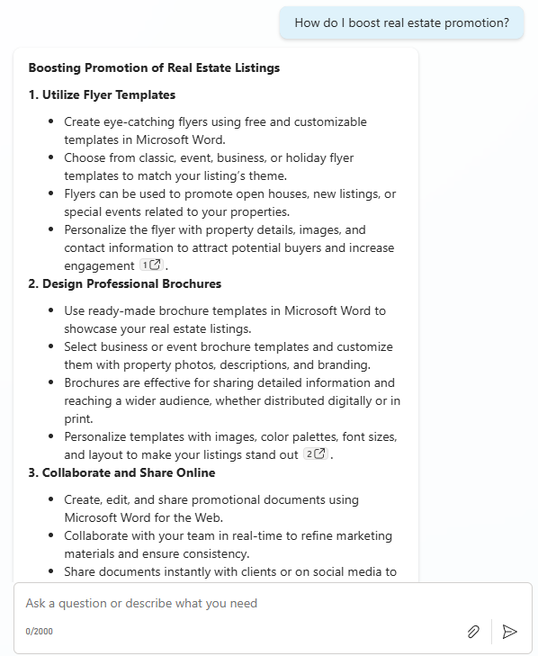

---
lab:
  title: Crear un agente inicial
  module: Administrar temas en Microsoft Copilot Studio
  description: En este ejercicio, accederá al portal de Microsoft Copilot Studio, seleccionará el entorno adecuado y creará un nuevo agente.
  duration: 84 minutos
  level: 200
  islab: true
  primarytopics:
    - Microsoft Copilot
    - Microsoft Copilot Studio
---

# Crear un agente inicial

## Escenario

En este ejercicio, usted:

- Creará y asignará un nombre a un agente
- Definirá cómo debe comportarse el agente mediante instrucciones
- Agregará un sitio web público como origen de conocimiento

Este ejercicio tardará aproximadamente **15** minutos en completarse.

## Lo que aprenderá

- Cómo crear un agente mediante lenguaje natural
- Cómo influyen las instrucciones del agente en el comportamiento generativo
- Cómo funcionan las respuestas de Generative AI con conocimiento configurado

## Pasos generales del laboratorio

- Crear un nuevo agente
- Definir el comportamiento del agente mediante instrucciones
- Agregar orígenes de conocimiento de Generative AI
  
## Requisitos previos

- Debe haber completado **Laboratorio: Importar solución de Dataverse**

## Ejercicio 1 - Crear agente

En este ejercicio, accederá al portal de Microsoft Copilot Studio, seleccionará el entorno adecuado y creará un nuevo agente.

### Tarea 1.1 - Crear un agente en la solución Bookings

1. En una nueva pestaña del navegador, vaya a `https://copilotstudio.microsoft.com`.

1. Asegúrese de estar en el entorno adecuado.

1. Seleccione **Agents** en la navegación izquierda.

1. Seleccione la flecha junto a **Create blank agent** \> **Advanced create**.

1. Valide que **Solution** tenga como valor predeterminado **Bookings**.

1. Escriba `labagent` en **Schema Name**.

1. Seleccione **Confirm and create**.

Su agente comenzará a configurarse. Una vez aprovisionado, podrá continuar con la configuración del agente.

### Tarea 1.2 - Configurar los detalles y las instrucciones del agente

1. En la sección **Details**, seleccione **Edit**

1. En el cuadro de texto **Name**, escriba **`Real Estate Booking Service`**

1. En el cuadro de texto **Description**, escriba **`Create bookings for real estate properties`**

1. Seleccione **Save**.

1. En la sección **Instructions**, seleccione **Edit**

1. Actualice las instrucciones a:

    ```prompt
    You are a real estate booking assistant.
    Help users with questions related to real estate properties and booking showings by using the knowledge and data that are available to you.

    When responding:
    Use the information provided through your configured knowledge sources whenever possible.
    If a user’s request is unclear or missing required details, ask a follow‑up question to gather the information you need.
    If you do not have enough information to answer confidently, do not guess. Instead, explain what information is missing or guide the user to provide it.
    
    Keep responses clear, helpful, and focused on assisting the user with booking‑related tasks.
    ```

1. Use **Save** para guardar las instrucciones.

    > **Nota**: Las instrucciones del agente orientan cómo debe comportarse el agente, pero no imponen estrictamente ese comportamiento. En laboratorios posteriores, aprenderá a hacer que este comportamiento sea predecible mediante el uso de temas, respuestas generativas con orígenes de conocimiento restringidos y configuración de fallback.

1. En el panel derecho **Test your agent**, escriba **`How do I make a booking?`** y revise la respuesta.

Deje esta ventana abierta.

## Ejercicio 2 - Agregar respuestas de Generative AI

En este ejercicio, agregará conocimiento que el agente podrá usar para generar respuestas.

### Tarea 2.1 - Agregar un origen de conocimiento

1. Seleccione la pestaña **Knowledge**.

    

1. Seleccione **+ Add knowledge**.

1. Seleccione **Public websites**

1. En el cuadro de texto **Public website link**, escriba **`https://www.realtor.com/marketing/resources`**. Este sitio web público contiene sugerencias de marketing inmobiliario que podrían ser útiles para su agente.

1. Seleccione **Add**.

1. Seleccione **Add to agent**.

### Tarea 2.1 - Probar respuestas de Generative AI

1. Seleccione la pestaña **Overview**.

1. Seleccione el menú de puntos suspensivos **…** en la parte superior del panel **Test your agent**.

1. Habilite **Track between topics**.

    

1. En la parte superior del panel **Test your agent**, seleccione el icono **Start new test session**.

    

1. En el cuadro de texto, escriba **`How do I boost real estate promotion?`** y revise la respuesta.

    


## Resumen
En este laboratorio, creó un agente y definió su comportamiento esperado mediante instrucciones. También agregó un sitio web público como origen de conocimiento y probó el agente con preguntas que el origen de conocimiento podía ayudar a responder. Aunque estas instrucciones orientan las respuestas generativas, en laboratorios posteriores verá cómo imponer un comportamiento predecible mediante temas, entidades, herramientas y configuración de fallback.