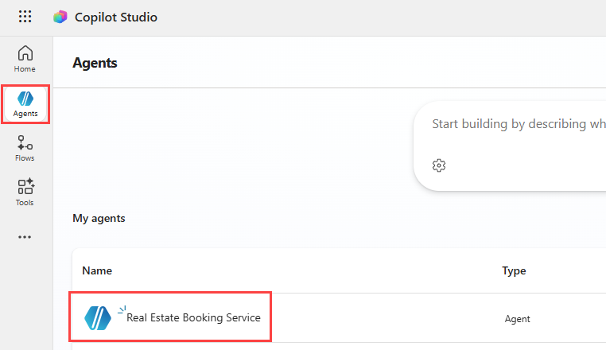
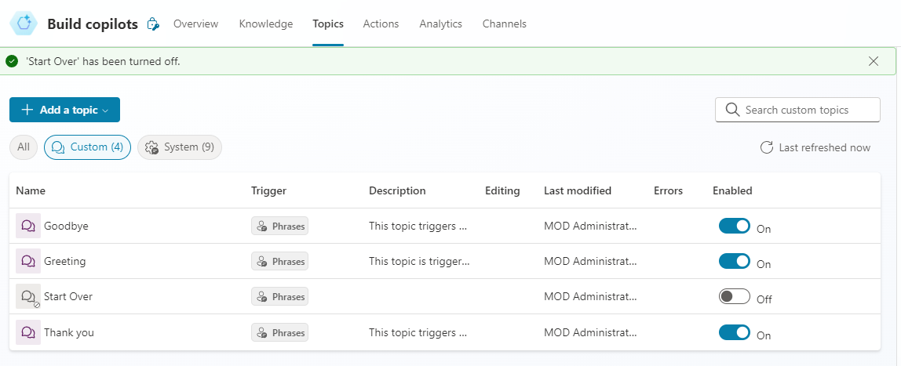
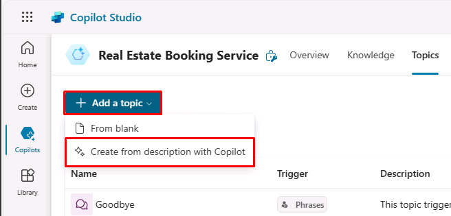
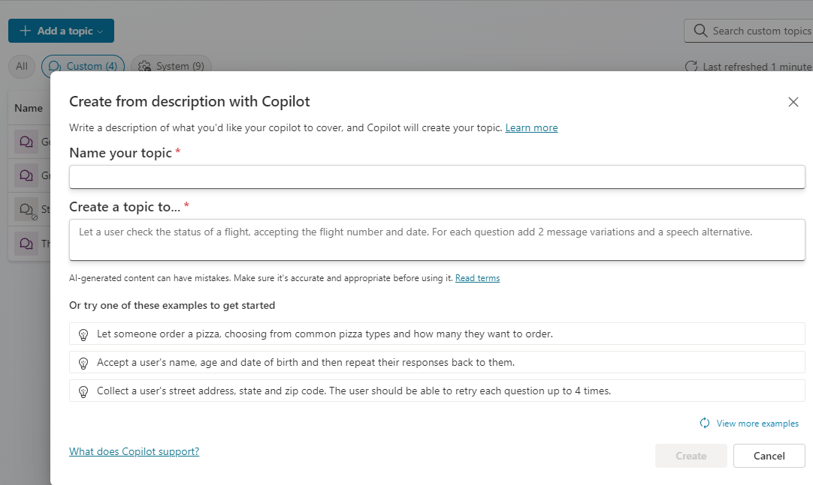
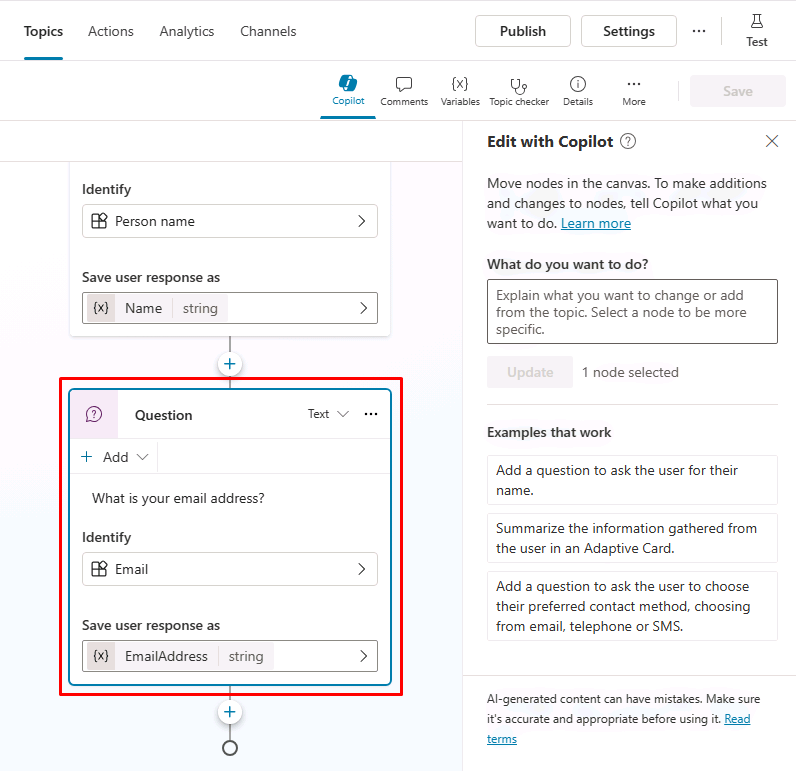
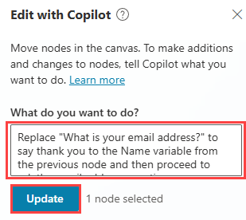
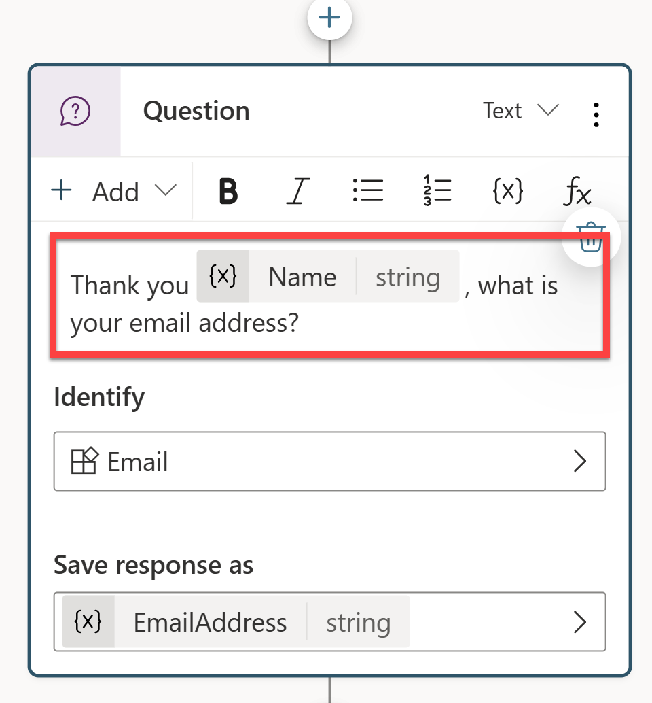
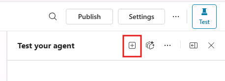

```markdown
---
lab:
  title: Administrar temas
  module: Administrar temas en Microsoft Copilot Studio
  description: En este ejercicio, usará Copilot para crear un tema a partir de una descripción. Esto permite que la IA generativa redacte la estructura inicial, que luego podrá refinar.
  duration: 102 minutos
  level: 100
  islab: true
---

# Administrar temas

## Escenario

En este ejercicio, usted:

- Administrará temas existentes
- Creará y editará temas mediante Copilot
- Creará un tema manualmente y agregará frases desencadenadoras

Este ejercicio tardará aproximadamente **30** minutos en completarse.

## Lo que aprenderá

- Cómo los temas complementan las respuestas de IA generativa
- Cuándo se usan los temas para imponer conversaciones estructuradas
- Cómo crear y refinar temas mediante lenguaje natural

## Pasos generales del laboratorio

- Revisar y deshabilitar temas innecesarios
- Crear un tema mediante Copilot
- Editar el contenido del tema mediante lenguaje natural
- Probar el comportamiento del tema con la IA generativa habilitada
  
## Requisitos previos

- Debe haber completado **Laboratorio: Crear un agente inicial**


## Concepto clave: Temas e IA generativa
Cuando la IA generativa está habilitada, el agente puede responder preguntas de forma dinámica sin desencadenar un tema. Este es el comportamiento esperado.

Los temas se usan cuando necesita:
- Recopilar información requerida paso a paso
- Controlar el orden de las preguntas
- Almacenar respuestas en variables
- Garantizar resultados predecibles

En laboratorios posteriores, usará temas junto con nodos, entidades y herramientas para imponer el comportamiento del agente.

## Pasos detallados

## Ejercicio 1 - Revisar y deshabilitar temas

En este ejercicio, revisará los temas existentes y deshabilitará uno que no es necesario.

### Tarea 1.1 – Deshabilitar temas

1. Vaya al portal de Microsoft Copilot Studio `https://copilotstudio.microsoft.com` y asegúrese de estar en el entorno adecuado.

1. Seleccione **Agents** en el panel de navegación izquierdo.

1. Seleccione el agente **Real Estate Booking Service** que creó en el laboratorio anterior.

    

1. Seleccione la pestaña **Topics**.

1. Busque el tema **Start Over**.

1. Cambie **Enabled** a **Off** para el tema **Start Over**.

    

Deshabilitar los temas no utilizados ayuda a reducir la ambigüedad cuando varios temas o respuestas generativas podrían atender la misma solicitud.

## Ejercicio 2 - Crear temas mediante lenguaje natural

En este ejercicio, usará Copilot para crear un tema a partir de una descripción. Esto permite que la IA generativa redacte la estructura inicial, que luego podrá refinar.

### Tarea 2.1 – Agregar un tema a partir de una descripción

1. Seleccione **+ Add a topic** y después **Add from description with Copilot**. Aparecerá una nueva ventana.

    

    

1. En el cuadro de texto **Name your topic**, escriba **`Detalles del cliente`**.

1. En el cuadro de texto **Create a topic to...**, escriba **`Preguntar al cliente su nombre y dirección de correo electrónico`**.

1. Seleccione **Create**.

1. Seleccione **Save**.

### Tarea 2.2 – Editar el contenido del tema mediante lenguaje natural

1. Si el panel **Test your agent** está abierto, ciérrelo.

1. Si el panel **Edit with Copilot** no aparece en el lado derecho del panel **Customer Details**, seleccione el icono **Copilot** en la parte superior del lienzo de creación.

    

1. Seleccione el segundo nodo **Pregunta (Question)** **What is your email address?**

    

1. En el panel **Edit with Copilot**, en el campo **What do you want to do?**, escriba el siguiente texto:

    `Cambie "What is your email address?" para que agradezca a la variable Nombre (Name) del nodo anterior y luego continúe preguntando por la dirección de correo electrónico.`

1. Seleccione **Update**.

    

    

    > **Nota**: El mensaje debe actualizarse para incluir la variable *Nombre (Name)* del nodo anterior y debe verse de forma similar a la captura de pantalla anterior. Si **Edit with Copilot** no actualizó correctamente el nodo de pregunta, seleccione **Undo** y vuelva a intentarlo con un prompt diferente.

1. Seleccione **Save**.

### Tarea 2.3 – Agregar un resumen mediante lenguaje natural

Además de actualizar nodos existentes, puede usar Copilot para agregar nuevos nodos.

1. Haga clic en un área vacía del lienzo de creación para que no haya ningún nodo seleccionado.

1. En el panel **Edit with Copilot**, en el campo **What do you want to do?**, escriba el siguiente texto:

    `Resuma la información recopilada en una tarjeta adaptable`

1. Seleccione **Update**.

Se agrega al final del tema un nodo de mensaje con una Tarjeta adaptable (Adaptive Card).


1. Seleccione el cuadro **Media** en la Tarjeta adaptable (Adaptive Card). Las propiedades de la Tarjeta adaptable (Adaptive Card) deberían aparecer en el lado derecho de la página.

    

   La fórmula de la Tarjeta adaptable (Adaptive Card) debería verse de forma similar a la anterior. Si no es así, puede pegar la fórmula siguiente:

    ```json
    {
    type: "AdaptiveCard", 
        body: 
        [
            {
                type: "TextBlock",
                size: "Medium",
                weight: "Bolder",
                text: "Summary"    
            },
            {
                type: "FactSet",
                facts: 
                [
                    {
                        title: "Full Name",
                        value: Text(Topic.Name)
                    },
                    {
                        title: "Email Address",
                        value: Text(Topic.EmailAddress)
                    }
                ]
            },
            {
                type: "TextBlock",
                text: "Thank you for providing the information."
            }
        ]
    }
    ```

1. Asegúrese de que no haya ningún nodo seleccionado seleccionando el espacio vacío del lienzo de creación.

1. Seleccione el icono **Copilot** para volver a abrir el panel **Edit with Copilot**.

1. En el campo **What do you want to do?**, escriba el siguiente texto:

    `Agregue una nueva pregunta de opción múltiple para consultar al usuario si los detalles son correctos, con dos opciones: Sí (Yes) o No`

1. Seleccione **Update**.

1. Se agrega al final del tema un nuevo nodo de pregunta con opciones para que el usuario seleccione.

    

1. Seleccione **Save**.

En laboratorios posteriores, usará esta respuesta para controlar la lógica de ramificación e imponer un comportamiento predecible.

## Ejercicio 3 - Probar el tema

1. Para volver a abrir el panel de prueba, seleccione el icono **Test** en la esquina superior derecha de la página.

1. Seleccione el icono **Start new test session** en la parte superior del panel de pruebas.

    

1. En el cuadro de texto, escriba **`Información del cliente`**.

1. Proporcione un nombre y una dirección de correo electrónico cuando se le solicite.

1. Seleccione **Sí (Yes)** cuando se le pida confirmar los detalles.

1. Seleccione **Save**

Observe cómo el agente usa el tema para controlar la conversación, recopila la información requerida paso a paso y anula temporalmente las respuestas generativas de formato libre.
```