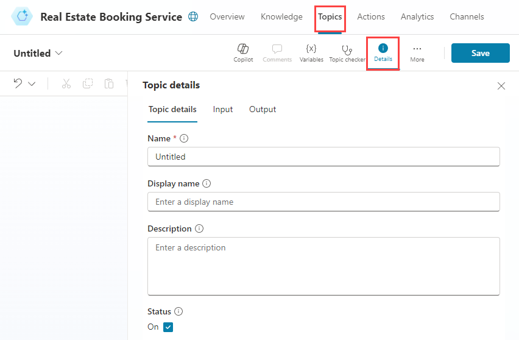
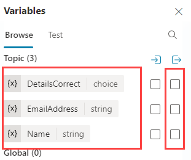
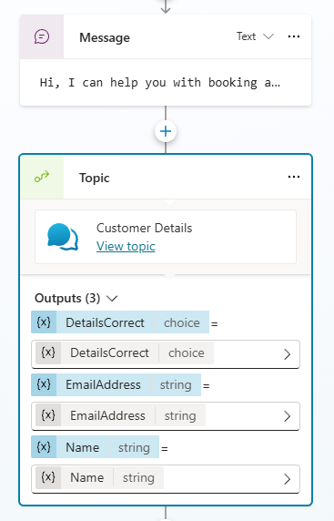
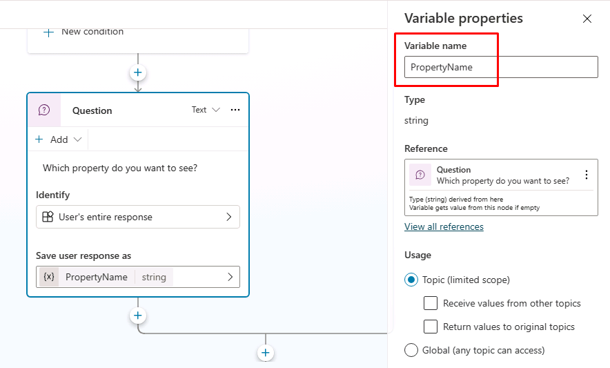
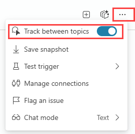
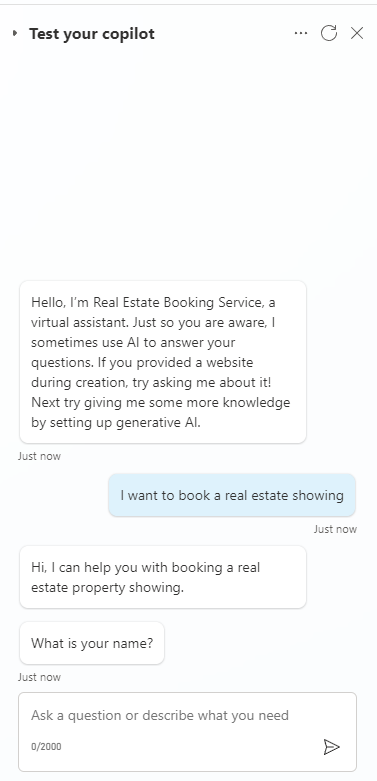

---
lab:
  title: Administrar nodos
  module: Administrar temas en Microsoft Copilot Studio
  description: En este laboratorio, creó el tema (topic) Book Showing y usó nodos (nodes) para aplicar una interacción estructurada paso a paso mientras la IA generativa permanecía habilitada. También configuró el ámbito de las variables para que la información recopilada en Customer Details pueda usarse entre temas (topics).
  duration: 152 minutes
  level: 100
  islab: true
---

# Administrar nodos

## Escenario

En este ejercicio, creará un flujo de conversación predecible y paso a paso mediante nodos (nodes) mientras la IA generativa permanece habilitada. Cuando la IA generativa está habilitada, el agente puede responder dinámicamente a algunos prompts. Los temas (topics) y los nodos (nodes) se usan cuando necesita resultados estructurados y repetibles; por ejemplo, recopilar información obligatoria en un orden fijo.

En este ejercicio, hará lo siguiente:

- Crear el tema (topic) **Book Showing**
- Agregar nodos (nodes) para aplicar un flujo de conversación estructurado
- Probar el agente y comprobar el enrutamiento de temas (topics)

Este ejercicio tardará aproximadamente **30** minutos en completarse.

## Lo que aprenderá

- Cómo usar nodos (nodes) para aplicar una conversación estructurada cuando la IA generativa está habilitada
- Cómo compartir variables entre temas (topics) mediante el ámbito de las variables
- Cómo crear flujos de temas (topics) repetibles y paso a paso mediante nodos (nodes) de mensaje, pregunta, condición y administración de temas

## Pasos generales del laboratorio

- Crear el tema (topic) Book Showing
- Configurar el ámbito de las variables para usar variables del tema (topic) Customer Details en el tema (topic) Book Showing
- Crear y editar nodos (nodes)
- Probar el agente
  
## Requisitos previos

- Debe haber completado **Lab: Manage topics**

## Pasos detallados

## Ejercicio 1 - Crear un tema desde cero

En este ejercicio, creará el tema (topic) **Book Showing** y agregará frases desencadenadoras (trigger phrases). Las frases desencadenadoras (trigger phrases) ayudan al agente a reconocer cuándo el usuario intenta reservar una visita.

### Tarea 1.1 - Crear un tema desde cero

1. Vaya al portal de Copilot Studio `https://copilotstudio.microsoft.com` y asegúrese de estar en el entorno adecuado.

1. Seleccione **Agents** en el panel de navegación izquierdo.

1. Seleccione el agente **Real Estate Booking Service** que creó en el laboratorio anterior.

1. Seleccione la pestaña **Topics**.

1. Seleccione **+ Add a topic** y luego **From blank**.

1. Seleccione el icono **Details** para abrir el cuadro de diálogo de detalles del tema (topic) (es posible que deba seleccionar **More** \> **Details**).

    

1. En el campo **Name**, escriba el texto siguiente:

    `Book Showing`

1. En el campo **Description**, escriba el texto siguiente:

    `Use este tema cuando un usuario quiera reservar, programar u organizar una visita a una propiedad inmobiliaria`

1. Seleccione **Save**.

### Tarea 1.2 - Comprobar el tipo de desencadenador

1. Seleccione el nodo (node) **Trigger** en la parte superior del tema (topic). Confirme que el tipo de desencadenador esté establecido en **The agent chooses**. 

> **Nota** Con la orquestación generativa (generative orchestration) habilitada, el agente usa esta descripción para decidir cuándo iniciar el tema (topic).

## Ejercicio 2 - Ámbito de las variables

Habilite las variables para que otros temas (topics) puedan acceder a ellas.

### Tarea 2.1 - Configurar el ámbito de las variables

1. Seleccione la pestaña **Topics**.

1. Seleccione el tema (topic) **Customer Details**.

1. Seleccione **Variables** en la barra superior para abrir el panel Variables (es posible que deba seleccionar **More** \> **Variables**).

1. Seleccione y expanda las variables de **Topic**.

1. Seleccione las casillas de verificación del lado derecho para las tres variables del tema (topic). Esto permite que las variables de este tema (topic) estén disponibles para que otros temas (topics) las usen.

    

1. Seleccione **Save**.

## Ejercicio 3 - Crear un flujo de tema estructurado con nodos

En este ejercicio, agregará nodos (nodes) al tema (topic) Book Showing para aplicar un flujo repetible y paso a paso.

### Tarea 3.1 - Agregar un nodo de mensaje

1. Seleccione la pestaña **Topics**.

1. Seleccione el tema (topic) **Book Showing**.

1. Seleccione el icono **+** debajo del nodo (node) Trigger y luego **Send a message**.

    

1. En el campo **Enter a message**, escriba el texto siguiente:

    `Hola, puedo ayudarle a reservar una visita a una propiedad inmobiliaria.`

1. Seleccione **Save**.

### Tarea 3.2 - Enrutar al tema Customer Details

1. Seleccione el icono **+** debajo del nodo (node) **Message**.

1. Seleccione **Topic management** \> **Go to another topic** \> **Customer Details**.

    

1. Seleccione **Save**.

### Tarea 3.3 - Agregar un nodo de condición

1. Seleccione el icono **+** debajo del nodo (node) **Topic** y luego **Add a condition**.

1. En el nodo (node) **Condition**, seleccione la variable **DetailsCorrect**.

1. Seleccione **is equal to**.

1. Seleccione **Yes**.

    

1. Seleccione **Save**.

### Tarea 3.4 - Agregar nodos de pregunta

1. Seleccione el icono **+** debajo del nodo (node) **Condition** de la izquierda y luego **Ask a question**.

1. En el campo **Enter a message**, escriba el texto siguiente:

    `¿Qué propiedad desea ver?`

1. Seleccione **User's entire response** para **Identify**.

1. Seleccione la variable en **Save user response as** y escriba **`PropertyName`** para **Variable name**.

    

1. Seleccione **Save**.

1. Seleccione el icono **+** debajo del nuevo nodo (node) **Question** y luego **Ask a question**.

1. En el campo **Enter a message**, escriba el texto siguiente:

    `¿Qué fecha y hora desea para ver la propiedad?`

1. Seleccione **Date and time** para **Identify**.

1. Seleccione la variable en **Save user response as** y escriba **`VisitDateTime`** para **Variable name**.

1. Seleccione el icono **+** debajo del nodo (node) **Question** de la izquierda y luego **Send a messsage**.

1. En el campo **Enter a message**, escriba el texto siguiente:

    `¡Excelente! Permítame programarlo para usted.`

1. Después de ese nodo de mensaje (message node), agregue un nodo (node) para finalizar los temas (topics) seleccionando **Topic Management** \> **End all topics**.

1. Seleccione **Save**.

## Ejercicio 4 - Probar el agente

En este ejercicio, probará el enrutamiento de temas (topics) y confirmará que la conversación siga el flujo paso a paso esperado.

### Tarea 4.1 - Probar el tema Book Showing

1. Seleccione el icono **Test** en la esquina superior derecha de la página para abrir el panel de pruebas.

1. Seleccione el menú de puntos suspensivos **...** en la parte superior del panel de pruebas, en la esquina superior derecha de la página.

1. Si no está habilitado, habilite **Track between topics**.

    

1. Seleccione el icono **Start new test session** en la parte superior del panel de pruebas.

1. Cuando aparezca el mensaje **Conversation Start**, el agente iniciará una conversación. Como respuesta, intente desencadenar el tema (topic) que creó:

    `Quiero reservar una visita a una propiedad inmobiliaria`

1. El agente debería responder con la pregunta "¿Cuál es su nombre?".

    

1. Proporcione un nombre.

1. Proporcione una dirección de correo electrónico.

1. Después de proporcionar la información, una tarjeta adaptable (Adaptive Card) muestra la información que ingresó y pregunta si los detalles son correctos. Seleccione **Yes**.

Observe que fue redirigido al tema (topic) **Book Showing**.

1. Escriba `Casa Colonial en Coyoacán` en el prompt **Which property to you want to see?**

1. Escriba `Mañana a las 10:00 AM` en el prompt **What date and time do you want to see the property?**.

    

## Resumen
En este laboratorio, creó el tema (topic) Book Showing y usó nodos (nodes) para aplicar una interacción estructurada paso a paso mientras la IA generativa permanecía habilitada. También configuró el ámbito de las variables para que la información recopilada en Customer Details pueda usarse entre temas (topics).