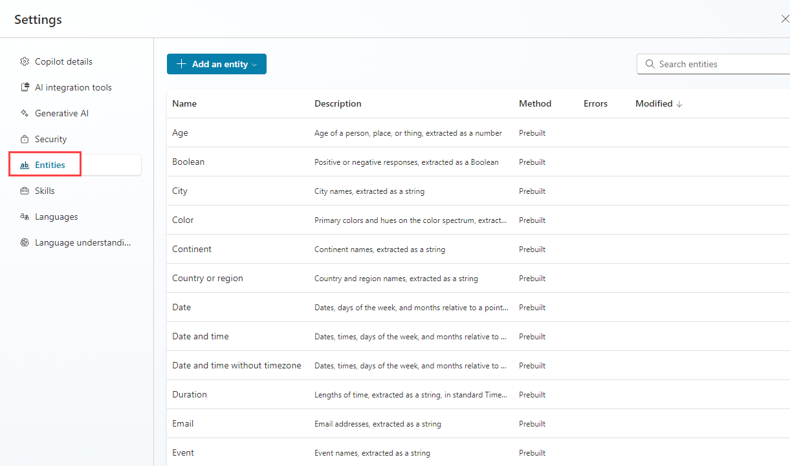
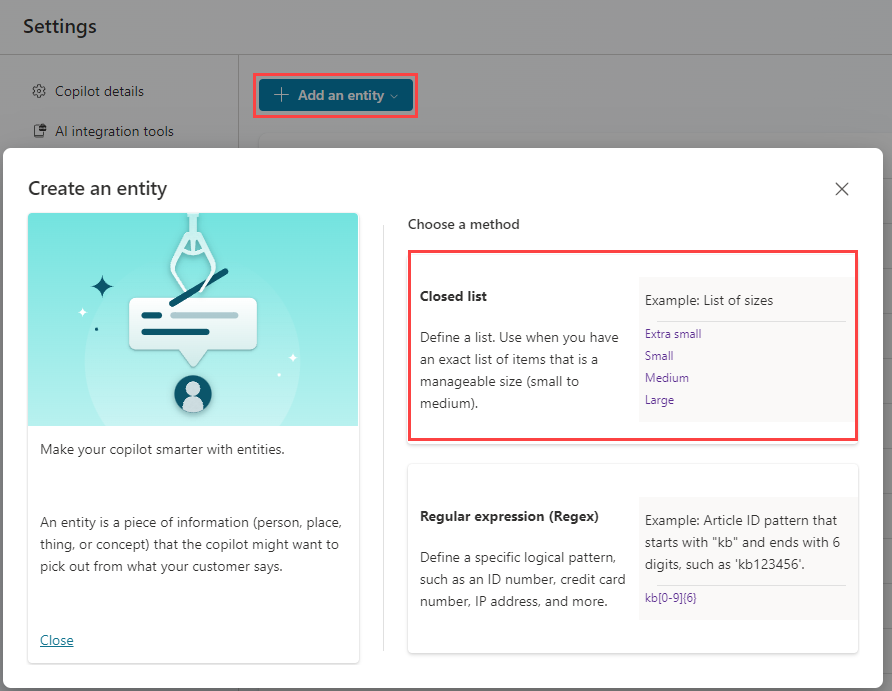
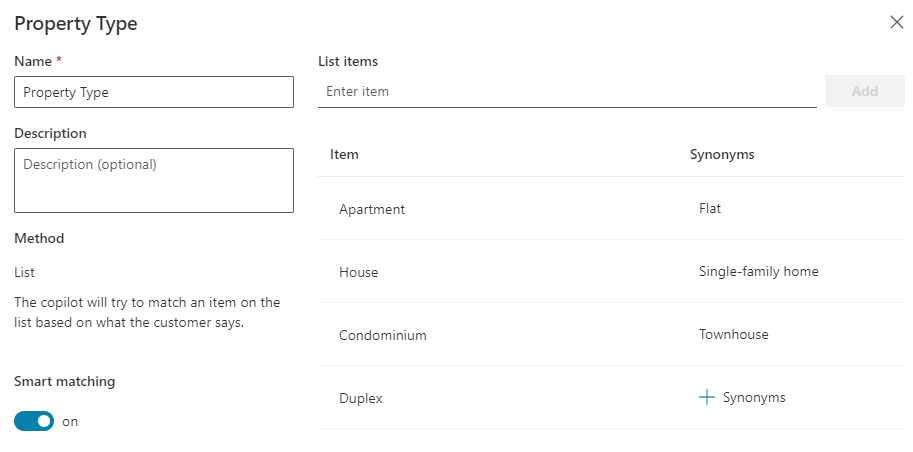
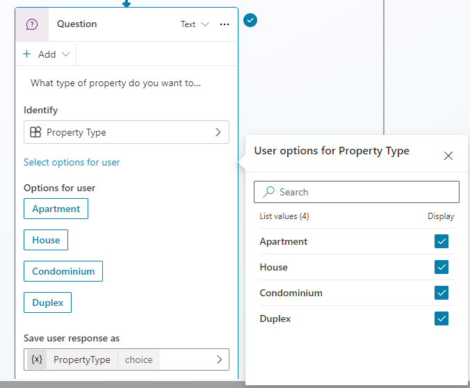

---
lab:
  title: Trabajar con entidades
  module: Trabajar con entidades y variables en Microsoft Copilot Studio
  description: En este laboratorio, usó entidades (entities) para extraer valores estructurados del lenguaje natural mientras la IA generativa permanecía habilitada. Las entidades (entities) permiten que el agente acepte entradas flexibles mientras mantiene un comportamiento predecible.
  duration: 122 minutes
  level: 100
  islab: true
---

# Trabajar con entidades

## Escenario

En este ejercicio, hará lo siguiente:

- Crear y usar entidades (entities)

Este ejercicio tardará aproximadamente **15** minutos en completarse.

## Lo que aprenderá

- Cómo usar entidades (entities) con IA generativa
- Cómo las entidades (entities) convierten entradas de formato libre en variables estructuradas

## Pasos generales del laboratorio

- Crear entidades (entities)
- Usar entidades (entities) en nodos (nodes)
  
## Requisitos previos

- Debe haber completado **Lab: Manage nodes**

## Pasos detallados

## Ejercicio 1 - Crear una entidad de Tipo de propiedad (Property Type)

Microsoft Copilot Studio usa entidades (entities) para comprender la intención del usuario. Se incluyen muchas entidades (entities) precompiladas para información de uso común. Puede crear entidades (entities) personalizadas para su propósito específico.

### Tarea 1.1 - Ver entidades precompiladas

1. Vaya al portal de Microsoft Copilot Studio `https://copilotstudio.microsoft.com` y asegúrese de estar en el entorno adecuado.

1. Seleccione **Agents** en el panel de navegación izquierdo.

1. Abra el agente **Real Estate Booking Service**.

1. Seleccione **Settings** en la esquina superior derecha de la pantalla.

1. Seleccione la pestaña **Entities**. Debería ver una lista de las entidades (entities) precompiladas para su agente.

    

### Tarea 1.2 - Crear la entidad de Tipo de propiedad (Property Type)

1. Seleccione **+ Add an entity** y luego **+ New entity**.

    

1. Seleccione **Closed list**.

1. Escriba **`Tipo Propiedad`** en el campo **Name**.

1. Agregue los siguientes elementos a la lista: 
    - Departamento 
    - Condominio 
    - Dúplex 
    - Casa 

1. Seleccione **+ Synonyms** para **Departamento**, escriba **`Loft`**, seleccione el icono **+** y luego seleccione **Done**.

1. Seleccione **+ Synonyms** para **Condominio**, escriba **`Propiedad commpartida`**, seleccione el icono **+** y luego seleccione **Done**.

1. Seleccione **+ Synonyms** para **Casa**, escriba **`Residencia`**, seleccione el icono **+** y luego seleccione **Done**.

1. Habilite **Concidencia inteligente**.

    

1. Seleccione **Save**.

1. Una vez guardada la entidad (entity), cierre la ventana de Tipo de propiedad (Property Type).

### Tarea 1.3 - Crear la entidad de número de habitaciones

1. Seleccione **+ Add an entity** y luego **+ New entity**.

1. Seleccione el mosaico **Regular expression (Regex)**.

1. Escriba **`Número de Habitaciones`** en el campo **Name**.

1. Escriba **`[1-5]`** en el campo **Pattern**.

1. Seleccione **Save**.

1. Una vez guardada la entidad (entity), cierre el panel de Número de habitaciones (Number of Bedrooms).

1. Seleccione el icono **X** en la esquina superior derecha para cerrar **Settings** y volver al agente.

## Ejercicio 2 - Usar entidades para mejorar el agente

Use entidades (entities) en el flujo de conversación para mejorar el agente.

### Tarea 2.1 - Usar entidades

1. Seleccione la pestaña **Topics**.

1. Seleccione el tema (topic) **Book Showing**.

1. Seleccione el icono **+** entre los nodos (nodes) **Condition** y **Question** de propiedad; luego seleccione **Ask a question**.

1. En el campo **Enter a message**, escriba el texto siguiente:

    `¿Qué tipo de propiedad desea ver?`

1. Seleccione **Tipo Propiedad** para **Identify**.

1. Seleccione **Select options for user** y marque la opción **Display** para los cuatro valores.

1. Seleccione la variable en **Save user response as** y escriba **`TipoPropiedad`** en **Variable name**.

    

1. Seleccione el icono **+** debajo del nuevo nodo (node) **Question** y luego seleccione **Ask a question**.

1. En el campo **Enter a message**, escriba el texto siguiente:

    `¿Cuántas habitaciones necesita?`

1. Seleccione **Number of Bedrooms** para **Identify**.

1. Seleccione la variable en **Save user response as** y escriba **`NumerodeHabitaciones`** en **Variable name**.

1. Seleccione **Save**.

### Tarea 2.2 - Probar la extracción de entidades

1. Abra el panel **Test**.

1. Habilite **Track between topics**.

1. Inicie una nueva sesión de prueba.

1. Cuando aparezca el mensaje de Inicio de conversación (Conversation Start), escriba y envíe `Quiero reservar una visita a una propiedad inmobiliaria`.

1. Confirme que el agente responda con el mensaje de saludo del tema (topic) **Reservar Visita**.

1. Proporcione un nombre y una dirección de correo electrónico cuando se le solicite y confirme la información.

1. Cuando se le pregunte qué tipo de propiedad desea ver, escriba `Estoy buscando una casa`.

    > Esta respuesta usa lenguaje natural de forma intencional. La entidad de Tipo de propiedad (Property Type) debe capturar Casa (House).

1. Cuando se le pregunte qué propiedad desea ver, escriba `Casa Colonial en Coyoacán`.

1. Cuando se le pregunte qué fecha y hora desea para ver la propiedad, escriba `Mañana a las 8:00 AM`.

Confirme que el agente responda con el mensaje que indica que la solicitud de reserva se está programando.

## Resumen

En este laboratorio, usó entidades (entities) para extraer valores estructurados del lenguaje natural mientras la IA generativa permanecía habilitada. Las entidades (entities) permiten que el agente acepte entradas flexibles mientras mantiene un comportamiento predecible.

En el siguiente laboratorio, usará herramientas (tools) para actuar sobre estos valores estructurados y realizar operaciones reales, como recuperar o crear datos.