---
lab:
  title: Crear flujos de agente (agent flows)
  module: Mejorar agentes de Microsoft Copilot Studio
  description: En este ejercicio, creará un flujo de agente (agent flow) que recupera una propiedad según los criterios proporcionados por el usuario.
  duration: 164 minutes
  level: 100
  islab: true
---

# Crear flujos de agente (agent flows)

## Escenario

En este laboratorio, usará los valores estructurados recopilados en laboratorios anteriores, como el tipo de propiedad, el nombre de la propiedad y la fecha de visita, para recuperar datos de Dataverse y crear una solicitud de reserva en Dataverse.

En este ejercicio, realizará lo siguiente:

- Crear un flujo de agente (agent flow)

Este ejercicio tardará aproximadamente **30** minutos en completarse.

## Lo que aprenderá

- Cómo crear una herramienta para ejecutar un flujo de agente (agent flow) en Copilot Studio

## Pasos generales del laboratorio

- Crear un flujo de agente (agent flow) para recuperar datos de Dataverse
- Crear un flujo de agente (agent flow) para crear datos de Dataverse
  
## Requisitos previos

- Debe haber completado el **Laboratorio: Trabajar con entidades (Lab: Work with entities)**

## Pasos detallados

## Ejercicio 1 - Crear una herramienta para recuperar datos de propiedades de Dataverse

En este ejercicio, creará un flujo de agente (agent flow) que recupera una propiedad según los criterios proporcionados por el usuario.

### Tarea 1.1 - Crear el flujo de agente (agent flow) Get Property

1. Navegue al portal de Microsoft Copilot Studio `https://copilotstudio.microsoft.com` y asegúrese de estar en el entorno adecuado.

1. Seleccione **Agents** en el panel de navegación izquierdo.

1. Abra el agente **Real Estate Booking Service**.

1. Seleccione la pestaña **Tools**.

1. Seleccione **+ Add a tool**.

1. En **Create new**, seleccione **Agent flow**.

1. Seleccione el paso desencadenador **When an agent calls the flow** y seleccione **+ Add an input**.

1. Seleccione **Text**.

1. Escriba `Bedrooms` en **Input** y `Number of Bedrooms` en **Please enter your input**.

    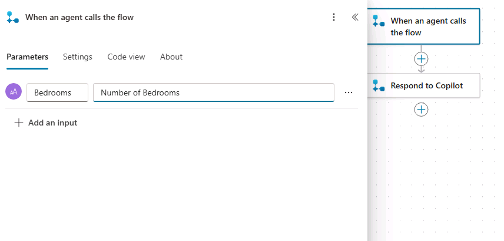

1. Seleccione **Save draft** cerca de la esquina superior derecha de la página.

### Tarea 1.2 - Recuperar datos de Dataverse

1. Seleccione el icono **+** entre los dos pasos del flujo para agregar una nueva acción.

1. Escriba `Dataverse` en el campo **Search** y seleccione **See more** para el conector **Microsoft Dataverse**.

    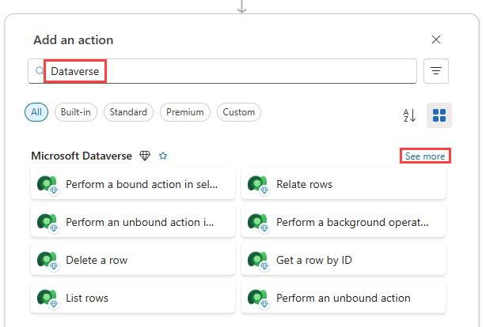

1. Seleccione la acción **List rows**.

1. Si se le solicita autenticación, escriba `Lab connection` en **Connection name**, seleccione **OAuth** en **Authentication Type**, seleccione **Sign in**, use las credenciales de su inquilino y seleccione **Allow access**.

    > **Nota (Note):** Si aparece un error '**Failed to create OAuth connection**', es posible que deba permitir ventanas emergentes en su navegador.

    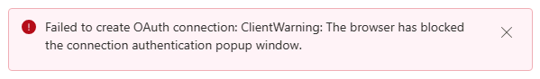

    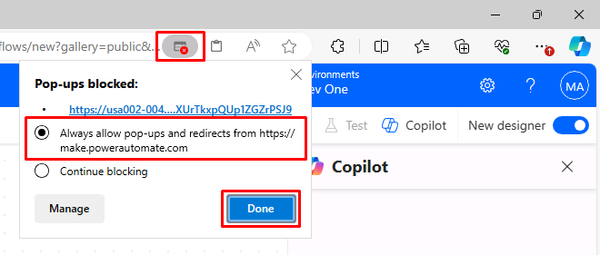

1. Seleccione **Real Estate Properties** como nombre de tabla.

1. Escriba `contoso_bedrooms eq ` (con un espacio después de **eq**) en el campo **Filter Rows**.

1. Con el campo **Filter Rows** aún seleccionado, seleccione el icono de **rayo** a su derecha y, a continuación, seleccione el parámetro **Bedrooms**.

    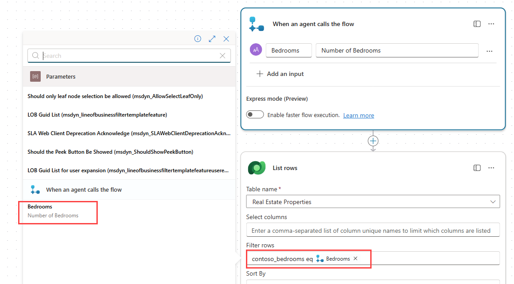

1. Seleccione **Save draft** cerca de la esquina superior derecha de la página.

### Tarea 1.3 - Devolver resultados al agente

1. Seleccione el nodo **Respond to the agent** en el lienzo de creación y seleccione **+ Add an output**.

1. Seleccione **Text**.

1. Escriba `PropertyId` en **Enter a name**.

1. Seleccione el campo **Enter a value to respond with** y seleccione **fx (Insert Expression)**.

1. Escriba la siguiente expresión en el campo superior:

    ```
    first(outputs('List_rows')?['body/value'])['contoso_realestatepropertyid']
    ```

1. Seleccione **Add**.

1. Seleccione **+ Add an output**.

1. Seleccione **Text**.

1. Escriba `PropertyName` en **Enter a name**.

1. Seleccione el campo **Enter a value to respond with** y seleccione **fx (Insert Expression)**.

1. Escriba la siguiente expresión:

    ```
    first(outputs('List_rows')?['body/value'])['contoso_propertyname']
    ```

    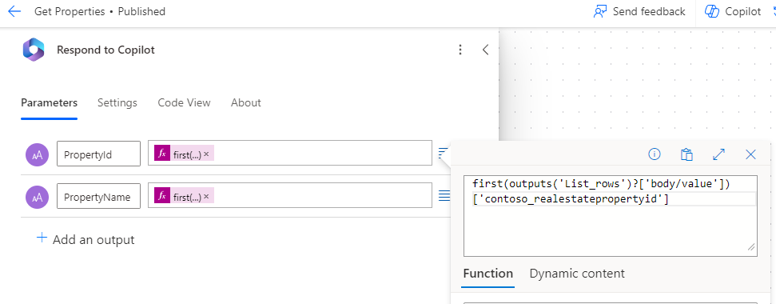

1. Seleccione **Add**.

1. Seleccione la pestaña **Settings** en el panel **Respond to the agent**.

1. Asegúrese de que **Asynchronous Response** esté establecido en **Off**.

    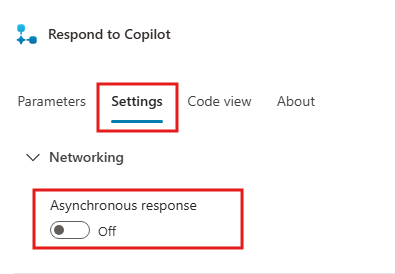

1. Seleccione **Save draft** cerca de la esquina superior derecha de la página.

1. Seleccione **Publish**.

1. En la ventana emergente **Your agent flow published successfully!**, seleccione **Go back to agent**.

1. Seleccione la herramienta de flujo de agente (agent flow) que acaba de crear.

1. En la sección **Details**, actualice el **Name** del Flow a `Get Property`.

1. Actualice la **Description** a `Get properties with the right number of bedrooms`.

1. Seleccione **Save**.

1. Seleccione la pestaña **Tools** y compruebe que aparezca el flujo Get Property que creó.

1. Seleccione **Publish**.

### Tarea 1.4 - Agregar la herramienta Get Property al tema (topic)

1. Seleccione la pestaña **Topics**.

1. Seleccione el tema (topic) **Book Showing**.

1. Seleccione el icono **+** debajo del nodo de pregunta **¿Cuántas habitaciones necesita? (How many bedrooms do you need?)**, seleccione **Add a tool**, seleccione la pestaña **Tool** y, a continuación, seleccione el flujo de agente (agent flow) **Get Property**.

1. En el panel de acciones **Get Property**, seleccione la lista de variables de **Bedrooms (String)** y elija la variable **NumberofBedrooms**.

1. Seleccione los **puntos suspensivos (...)** en el nodo de pregunta **¿Qué propiedad desea ver? (Which property do you want to see?)** y seleccione **Delete**.

1. Seleccione el icono **+** debajo del nodo **Tool** y seleccione **Send a message**.

1. En el campo **Enter a message**, escriba `Property ` (con un espacio después del texto).

1. En el mismo nodo, seleccione el icono **{X} (Insert variable)** y seleccione la variable **propertyname**.

    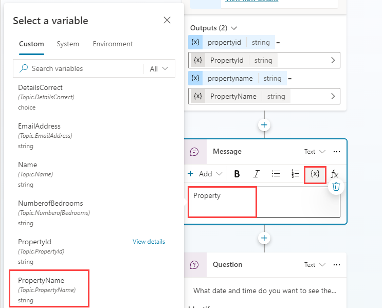

1. Seleccione **Save**.

## Ejercicio 2 - Crear una herramienta para crear una solicitud de reserva

Microsoft Copilot Studio puede crear datos en Microsoft Dataverse mediante flujos de agente (agent flows).

### Tarea 2.1 - Crear un flujo de agente (agent flow) para realizar una reserva

1. Seleccione la pestaña **Tools** en **Real Estate Booking Service**.

1. Seleccione **+ Add a tool**.

1. En **Create new**, seleccione **Agent flow**.

1. Seleccione **Save draft** y espere a que se guarde el flujo de agente (agent flow).

1. Seleccione la pestaña **Overview**.

1. Seleccione **Edit** en la sección **Details**.

1. Cambie el nombre del flujo de agente (agent flow) a `Create Booking Request`.

1. Seleccione **Save**.

1. Seleccione la pestaña **Designer**.

1. Seleccione el paso desencadenador **When an agent calls the flow** y seleccione **+ Add an input**.

1. Seleccione **Text**.

1. Escriba `PropertyId` en **Input** y `Property` en **Please enter your input**.

1. Seleccione **+ Add an input**.

1. Seleccione **Text**.

1. Escriba `ViewerName` en **Input** y `Viewer Name` en **Please enter your input**.

1. Seleccione **+ Add an input**.

1. Seleccione **Text**.

1. Escriba `ViewerEmail` en **Input** y `Viewer Email` en **Please enter your input**.

    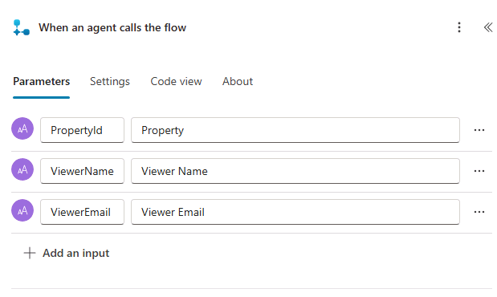

1. Seleccione el icono **+** entre los dos pasos del flujo para agregar una nueva acción.

1. Escriba `Dataverse` en el campo **Search** y seleccione **See more** para el conector **Microsoft Dataverse**.

1. Seleccione la acción **Add a new row**.

1. Seleccione **Booking Requests** como nombre de tabla.

1. Escriba `Agent booking` en el campo **Booking Name**.

1. Seleccione **Show all** en **Advanced parameters**.

1. Escriba `contoso_bookingrequests()` en el campo **Property (Real Estate Properties)**, coloque el cursor dentro de los paréntesis, seleccione el icono de **rayo** y, a continuación, seleccione el parámetro **PropertyId**.

1. Seleccione el campo **Viewer Email**, seleccione el icono de **rayo** y, a continuación, seleccione el parámetro **ViewerEmail**.

1. Seleccione el campo **Viewer Name**, seleccione el icono de **rayo** y, a continuación, seleccione el parámetro **ViewerName**.

    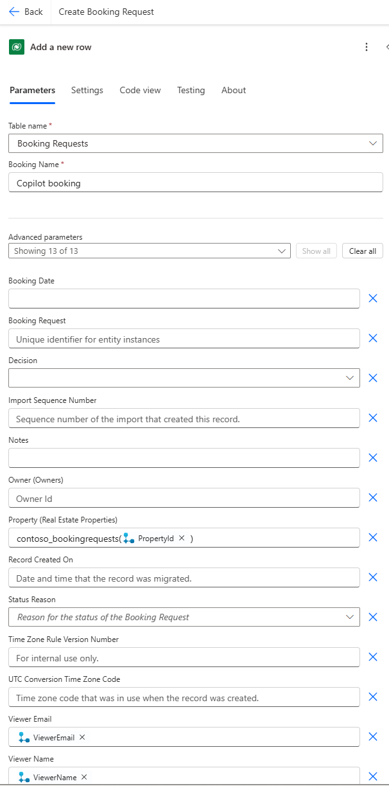

1. Seleccione la acción **Respond to the agent** y abra el panel **Respond to the agent**.

1. Seleccione la pestaña **Settings**.

1. Asegúrese de que **Asynchronous Response** esté establecido en **Off**.

1. Seleccione **Save draft** en la esquina superior derecha de la ventana.

1. Espere a que finalice el guardado y, a continuación, seleccione **Publish**.

### Tarea 2.2 - Validar sus herramientas

1. Regrese al agente **Real Estate Booking Service**.

1. Seleccione la pestaña **Tools** y valide que ambos flujos de agente (agent flows) estén en la lista. Si alguno no aparece, seleccione **+ Add a tool** > **Flow** > y seleccione el flujo de agente (agent flow) que falta. Seleccione **Add and configure**.

### Tarea 2.3 - Agregar la herramienta Create Booking Request al tema (topic)

1. Seleccione la pestaña **Topics**.

1. Seleccione el tema (topic) **Book Showing**.

1. Seleccione el icono **+** encima del nodo **End all topics** en la parte inferior, seleccione **Add a tool** y, a continuación, seleccione el flujo de agente (agent flow) **Create Booking Request**.

1. Seleccione la variable **PropertyId** para el parámetro de entrada **PropertyId**.

1. Seleccione la variable **Name** para el parámetro de entrada **ViewerName**.

1. Seleccione la variable **EmailAddress** para el parámetro de entrada **ViewerEmail**.

1. Seleccione **Save**.

1. Seleccione el nodo Action que acaba de crear para la herramienta Create Booking Request.

1. Seleccione **Copilot**.

1. En **What do you want to do?**, escriba: `Después de que se ejecute esta acción, envía un mensaje que indique que se programó la reserva de bienes raíces y agradece al usuario`.

1. Seleccione **Update**. 

Se creó un nodo Message. Revise el mensaje según lo desee para informar al usuario que se programó una reserva.

## Ejercicio 3 - Probar el agente

### Tarea 3.1 - Realizar una solicitud de reserva

1. Abra el panel **Test**.

1. Si no está habilitado, habilite **Track between topics**.

1. Seleccione el icono **Start new test session** en la parte superior del panel de pruebas.

1. Cuando aparezca el mensaje **Conversation Start**, el agente iniciará una conversación. Como respuesta, escriba una frase desencadenadora para el tema (topic) que creó:

    `Quiero reservar una visita a una propiedad inmobiliaria`

1. Escriba un nombre y una dirección de correo electrónico.

1. Después de proporcionar la información, una Tarjeta adaptable (Adaptive Card) muestra la información que escribió y pregunta si los detalles son correctos. Seleccione **Yes**.

1. Seleccione **House** para la solicitud del tipo de propiedad.

1. Escriba `3` para la solicitud del número de habitaciones.

    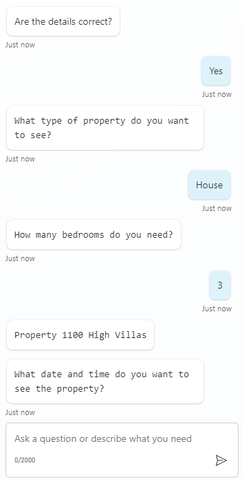

1. Escriba `Mañana a las 2:00 p. m.` para la solicitud **¿En qué fecha y hora desea ver la propiedad? (What date and time do you want to see the property?)**.

Se debe crear una solicitud de reserva según la información que proporcionó al agente.

### Tarea 3.2 - Comprobar la solicitud de reserva

1. Navegue a `https://make.powerapps.com` en una pestaña nueva.

1. Asegúrese de estar en el entorno adecuado.

1. Seleccione **Apps** en el panel de navegación izquierdo.

1. Seleccione **Play** en la aplicación basada en modelos **Real Estate Property Management**.

1. En el panel de navegación izquierdo, seleccione **Booking Requests**. Consulte la solicitud de reserva que el agente acaba de crear para usted.

    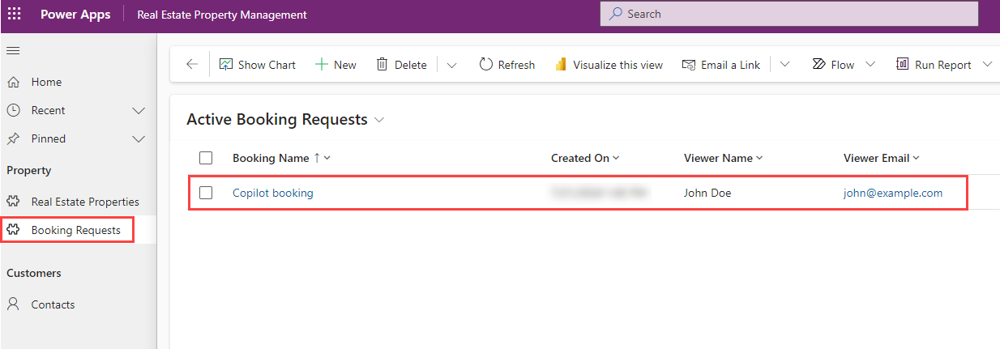
    