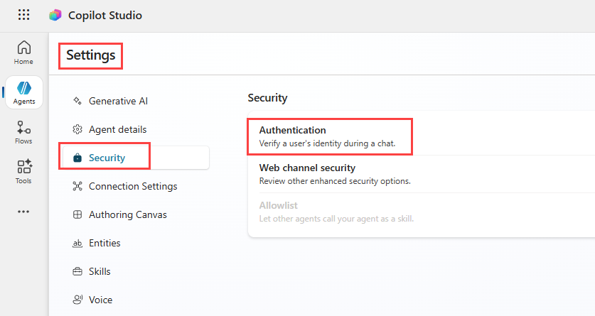
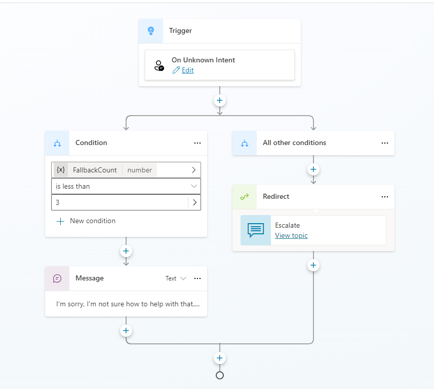
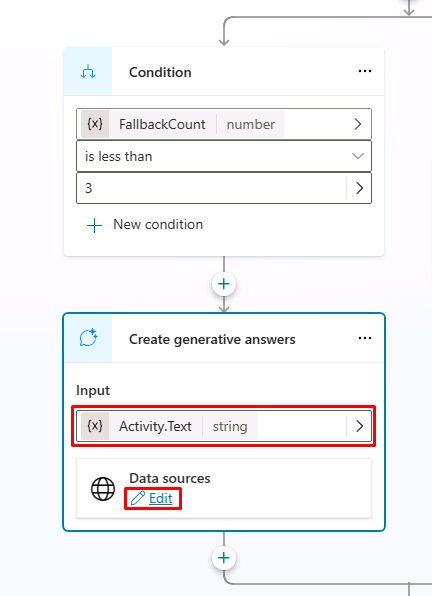

---
lab:
  title: Usar IA generativa en Microsoft Copilot Studio
  module: Mejorar agentes de Microsoft Copilot Studio
  description: 'En este laboratorio, configurará activamente el comportamiento de la IA generativa para preparar el agente para producción mediante lo siguiente:'
  duration: 120 minutes
  level: 100
  islab: true
  primarytopics:
    - Microsoft Copilot
    - Microsoft Copilot Studio
---

# Usar IA generativa en Microsoft Copilot Studio

## Escenario

En este laboratorio, preparará su agente para el uso en producción mediante la configuración de la fundamentación (grounding), el comportamiento de respaldo (fallback) y los controles de seguridad, mientras mantiene habilitada la IA generativa.

En este ejercicio, realizará lo siguiente:

- Configurar el agente para usar IA generativa únicamente con fuentes de conocimiento aprobadas
- Orientar al agente para que responda de manera predecible y segura cuando no pueda responder una pregunta

Este ejercicio tardará aproximadamente **20** minutos en completarse.

## Lo que aprenderá

- Cómo restringir la IA generativa mediante la fundamentación (grounding)
- Cómo configurar temas del sistema (system topics) para un comportamiento de respaldo (fallback) seguro
  
## Requisitos previos

- Debe haber completado el **Laboratorio: Crear flujos de agente (Lab: Create agent flows)**

## Pasos detallados

## Ejercicio 1 - Configurar la autenticación

### Tarea - Configurar la autenticación

1. Si aún no está abierto, vaya al portal de Microsoft Copilot Studio `https://copilotstudio.microsoft.com` y asegúrese de estar en el entorno adecuado.

1. Abra el agente **Servicio de Solicitudes de Reserva**.

1. Seleccione **Settings** en la esquina superior derecha de **Servicio de Solicitudes de Reserva**.

1. Seleccione la pestaña **Security**.

1. Seleccione **Authentication**.

    

1. Seleccione **Authenticate with Microsoft**.

1. Seleccione **Save**.

1. Seleccione **Save** en la ventana de confirmación.

1. Seleccione la **X** en la esquina superior derecha para cerrar **Settings**.

1. Seleccione **Publish**.

## Ejercicio 2 - Fundamentar las respuestas generativas (generative answers) en datos aprobados

En este ejercicio, configurará las respuestas generativas (generative answers) para que el agente solo pueda responder mediante conocimiento aprobado.

### Tarea 2.1 - Restringir las respuestas generativas (generative answers) en Potenciar Conversación (Conversational boosting)

1. Seleccione **Topics**.

1. Filtre por temas **System**.

1. Abra el tema **Potenciar Conversación (Conversational boosting)**.

1. Seleccione el nodo **Create generative answers**.

1. Seleccione **Edit** para **Data sources**.

1. Seleccione **Search only selected sources.**

1. Seleccione **Add knowledge**.

1. Seleccione la tabla de Dataverse **Real Estate Property** y **Add to agent**.

1. Marque tanto **website** como la tabla **Real Estate Property** como fuentes de conocimiento.

1. Desplácese hacia abajo y deshabilite **Allow the AI to use its own general knowledge**.

1. Seleccione **Save**.

El agente ya no puede responder preguntas abiertas mediante el conocimiento general del modelo.

## Ejercicio 3 - Reemplazar el respaldo (fallback) predeterminado por un respaldo (fallback) fundamentado

En este ejercicio, volverá a configurar el comportamiento de respaldo (fallback) del sistema.

### Tarea 3.1 - Usar respuestas generativas (generative answers) en el tema System fallback

1. Seleccione la pestaña **Topics** y seleccione el filtro **System**.

1. Seleccione el tema **Fallback**.

    

1. Seleccione el menú de **puntos suspensivos (...)** en el nodo **Message** y seleccione **Delete**.

1. Seleccione el icono **+** debajo del nodo **Condition** y, a continuación, seleccione **Advanced** \> **Generative answers**.

1. En el campo **Input**, seleccione la pestaña **System** y seleccione **Activity.Text**.

1. Seleccione **Edit** en **Data sources**.

    

1. Seleccione **Search only selected sources**.

1. Agregue **website** y la tabla de Dataverse **Real Estate Property**.

1. Desplácese hacia abajo y deshabilite **Allow the AI to use its own general knowledge**.

1. Seleccione la casilla **Customize** en **Content moderation level** y seleccione **Medium**.

1. Seleccione **Save**.

Cuando un agente no pueda responder una pregunta, responderá de forma segura mediante datos fundamentados, en lugar de realizar suposiciones.

## Tarea 3.2 - Agregar una respuesta de respaldo (fallback) controlada

1. En el tema Fallback, agregue un nodo **Send a message** después del nodo Generative answers.

1. Escriba el siguiente mensaje: `Lo siento, no tengo suficiente información para ayudarle con esa solicitud. Puedo ayudarle a reservar visitas a propiedades inmobiliarias o responder preguntas relacionadas con las propiedades disponibles.`

1. Seleccione **Save**.

Ahora el agente comunica claramente su alcance y sus limitaciones, en lugar de generar respuestas ambiguas. Tenga en cuenta que el tema Fallback solo se desencadena cuando el agente no puede seleccionar con confianza ningún tema (topic) ni una ruta de respuestas generativas (generative answers). El tema Fallback se usa únicamente para intenciones desconocidas.

## Ejercicio 4 - Validar el comportamiento en producción mediante acciones

En este ejercicio, formulará al agente preguntas que se encuentran tanto dentro como fuera del alcance de su conocimiento.

### Tarea 4.1 - Desencadenar un escenario compatible

1. Abra el panel **Test**.

1. Inicie una nueva sesión de prueba.

1. Formule una pregunta compatible con el conocimiento configurado, por ejemplo: `¿Hay alguna propiedad en Oak Lane?`

El agente debe responder mediante datos aprobados y fundamentados.

### Tarea 3.2 - Desencadenar un escenario no compatible

1. En la misma sesión de prueba, formule una pregunta fuera del alcance del agente, por ejemplo: `¿Qué hay para cenar?`

El agente debe evitar suponer una respuesta.

## Resumen

En este laboratorio, configuró activamente el comportamiento de la IA generativa para preparar el agente para producción mediante lo siguiente:

- Fundamentar las respuestas generativas (generative answers) en datos aprobados
- Reemplazar el comportamiento de respaldo (fallback) predeterminado
- Aplicar respuestas seguras y limitadas al alcance definido

### Desafío - Agregar conocimiento desde un archivo

Como desafío adicional, agregue un archivo como fuente de conocimiento adicional para el agente. Asegúrese de que también se agregue para Potenciar Conversación (Conversational boosting).

Para descargar el archivo: abra una ventana nueva y navegue a `https://download.microsoft.com/documents/customerevidence/Files/4000007499/SummitRealtyCaseStudy.docx`

