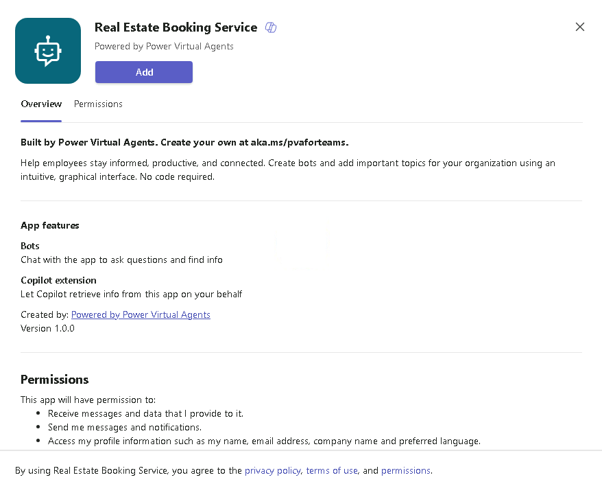
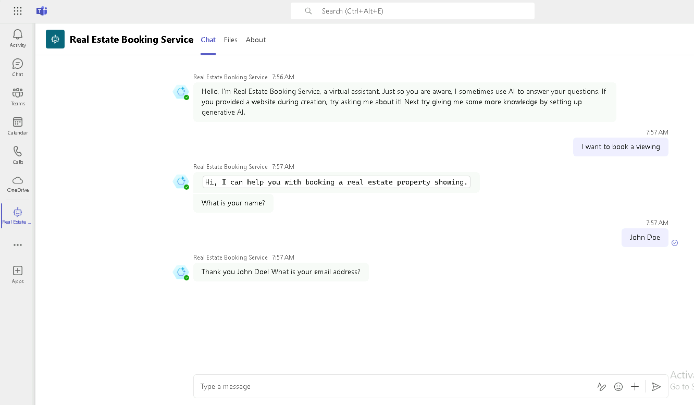

---
lab:
  title: Implementar un agente en Microsoft Teams
  module: Crear un agente con Microsoft Copilot Studio y Dataverse for Teams
  description: En este laboratorio, implementó su agente en Microsoft Teams. ¡Felicitaciones por completar sus laboratorios!
  duration: 54 minutos
  level: 100
  islab: true
  primarytopics:
    - Microsoft Teams
---

# Implementar un agente en Microsoft Teams

## Escenario

En este ejercicio, realizará lo siguiente:

- Implementar un agente en el canal de Microsoft Teams

Este ejercicio tardará aproximadamente **10** minutos en completarse.

## Lo que aprenderá

- Cómo implementar un agente en Microsoft Teams

## Pasos generales del laboratorio

- Publish
- Implementar un agente en Microsoft Teams
  
## Requisitos previos

- Debe haber completado el **Laboratorio: Usar IA generativa en Microsoft Copilot Studio**

## Ejercicio 1: Publicar el agente

### Tarea 1.1: Publicar el contenido más reciente

1. Vaya al portal de Microsoft Copilot Studio `https://copilotstudio.microsoft.com` y asegúrese de estar en el entorno adecuado.

1. Seleccione **Agents** en el panel de navegación izquierdo.

1. Seleccione el agente que creó en el laboratorio anterior.

1. Seleccione **Publish** y, a continuación, seleccione **Publish** nuevamente.

## Ejercicio 2: Canales

Una vez publicado el agente, puede ponerlo a disposición de los usuarios en Teams. De esta manera, usted, sus compañeros de equipo y el resto de la organización pueden interactuar con él.

### Tarea 2.1: Canal de Microsoft Teams

1. Con el agente abierto en Microsoft Copilot Studio, seleccione la pestaña **Channels**.

1. Seleccione el mosaico **Teams and Microsoft 365 Copilot**.

1. Anule la selección de **Make agent available in Microsoft 365 Copilot**.

1. Seleccione **Add channel**.

1. Seleccione **See agent in Teams**.

1. Seleccione **Cancel** en el cuadro de diálogo de **This site is trying to open Microsoft Teams**.

1. En la ventana emergente, seleccione **Cancel** y, a continuación, seleccione **Use the web app instead**.

1. Seleccione **Add** para agregar el agente a Teams.

    

1. Seleccione **Open** y espere a que el agente se cargue en Teams.

1. Pruebe el agente.

    

En este laboratorio, implementó su agente en Microsoft Teams. ¡Felicitaciones por completar sus laboratorios!